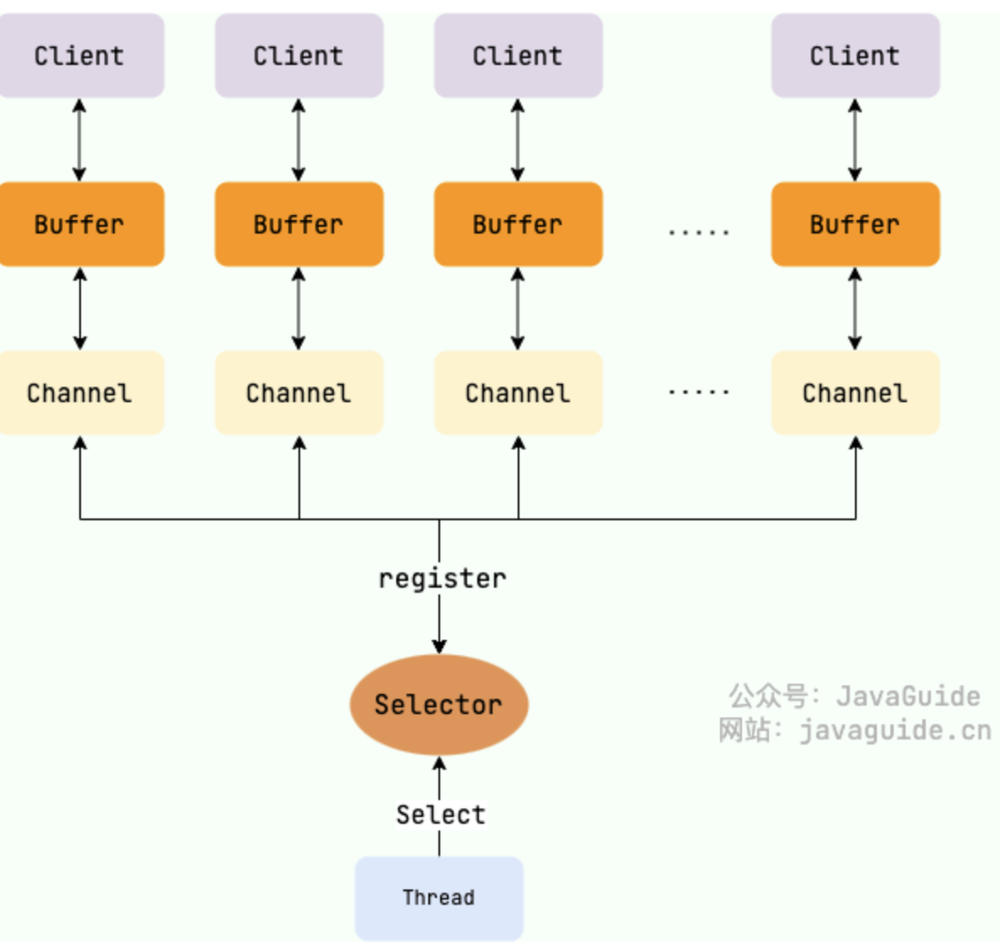
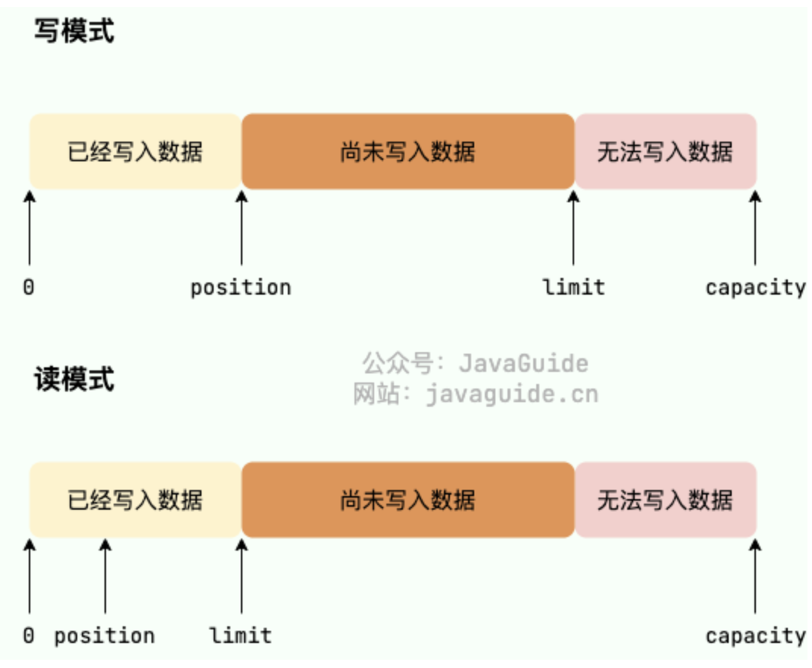
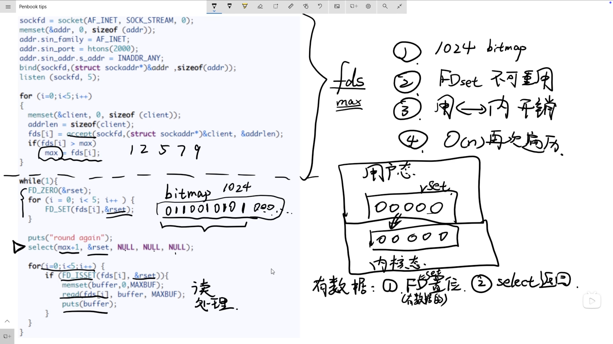

# <center>IO</center>

## Introduce

### 什么是IO

分成两个角度来进行分析: 

- 从计算机系统结构来分析， I/O 描述来计算机系统与外界设备之间的通信过程

- 我们从软件程序来进行分析， I/O 是指软件程序与外部设备之间的数据交换过程


### 应用程序 IO 

首先，我们知道一个进程的地址是分成 **内核空间** 和 **用户空间** 两个部分的。我们的应用程序是运行在用户空间的，而我们的设备驱动是运行在内核空间的。所以我们的应用程序是无法直接访问设备的，所以我们需要通过 **系统调用** 来进行访问。我们在 **用户空间** 发起调用请求，然后 **内核空间** 来帮我们完成系统调用。


而从应用程序的角度来看，我们的应用程序向操作系统的内核发起了 IO请求，操作系统负责执行具体的 IO请求。我们的应用程序只是发起了请求而已，具体的实现就是依靠操作系统来完成。

两个步骤来实现:

- 内核等待 I/O 设备准备好数据
- 内核将数据从内核空间拷贝到用户空间 


### IO分类

- 同步阻塞 I/O
- 同步非阻塞 I/O
- I/O 多路复用
- 信号驱动 I/O
- 异步 I/O


## Java IO

### BIO Blocking IO 
BIO 属于同步阻塞IO,就是说进程在发起 IO 请求之后，不能执行其他的任务，直到这个 IO 请求完成了为止。这样就会导致我们的程序效率很低。

在常见的单线程，或者客户端连接数量不高的情况，是可行的。但是在 十万甚至百万级连接的时候，传统的 BIO 就不能满足需求了。

一个代码的例子 

```java
public static void main(String[] args) throws IOException{
    ServerSocket serverSocket = new ServerSocket(8080);
    while(true){
        Socket socket = serverSocket.accept();
        InputStream inputStream = socket.getInputStream();
        byte[] buffer = new byte[1024];
        int len;
        while((len = inputStream.read(buffer)>0)){
            System.out.println(new String(buffer,0,len));
        }
    }
}
```

我们上面的 `Line 4` 的 `accept()` 方法，其实就是一个阻塞方法，只有这个socket等到了客户端的连接请求，才会继续执行下面的代码。这样就会导致我们的程序效率很低。


### NIO New IO 

> 注意 NIO 在Java中表示的是多路复用模型，而不是非阻塞IO

一个线程可以处理多个 Socket 的连接。 

> 我们还是以餐馆来作为例子，就是上面的 BIO 可以看成是 餐馆 只有1个座位，需要用户排队用餐。而 NIO 可以看成，每个用户的请求看成是取票，等到服务端叫号的时候，就可以进入用餐了。不用干等着，这个就是多路复用的特点。

对于设计一个高并发的系统，很自然的想法是设计一个多线程的方案，但是这也会带来 频繁上下文切换的代价。尤其是当我们的线程数目达到一定的数量的时候，这个代价就会变得很大。所以我们需要一个更好的解决方案。我们这里选择的就是 NIO 模型。用单线程来处理多个Socket连接。


#### 关键特性 



- Buffer 缓冲区:

    数据的存取是通过缓冲区进行的，而不是直接的进行读取或者写入数据流

- Channel 通道:

    它是连接数据源于缓冲区的媒介,通道是双向的，可以进行读取和写入操作.

- Selector 选择器:

    它是 NIO 中的一个核心组件，能够实现非阻塞IO，通过一个线程来处理多个通道的数据。


#### 缓冲区 Buffer




- 在传统的 BIO 模型中，数据的读写是面向流的，分为字节流和字符流。
    
- 在NIO库中，所有的数据都是用缓冲区来解决，有点类似 BIO 中的缓冲流.NIO 在读取数据的时候，是直接在读到缓冲区。在写入数据的时候，写入缓冲区。

```java
public abstract class Buffer {
    // Invariants: mark <= position <= limit <= capacity
    // Buffer 允许将位置直接定位到该标记处
    private int mark = -1;
    // 下一个可以被读写的位置
    private int position = 0;
    private int limit;
    private int capacity;
}
```

buffer 对象从创建伊始，就默认是写模式，只有在调用 `flip()` 方法的时候，就切换成读模式。如果再次要切换成写模式，可以调用`clear()` 方法.

Buffer对象不能通过`new` 来调用构造方法创建对象，只能通过静态方法来实例化 `Buffer`.


最核心的几个方法介绍:

- `put()` :写数据
- `get()` : 读取缓冲区中的数据
- `flip()` : 切换模式从写模式切换到读模式,将`limit`值变成`position`的值，将`position` 清空
- `clear()` : 从读模式切换到写模式

#### Channel 通道

BIO 中的通道是单向的，但是 NIO 中的通道是多向的。建立了与数据源之间的连接，可以利用它来读取和写入数据。因为 Channel 是全双工的，所以它好比流更好地映射底层操作系统的API 。同时支持读写操作。

一个通道具有不同的方法，而不是像 BIO 中会区分输入流和输出流.

```java
// 1. 打开一个 SocketChannel 连接
SocketChannel socketChannel = SocketChannel.open(new InetSocketAddress("localhost", 8080));
socketChannel.configureBlocking(false);  // 设置为非阻塞模式

// 2. 创建一个缓冲区
ByteBuffer buffer = ByteBuffer.allocate(1024);

// 3. 读取数据
int bytesRead = socketChannel.read(buffer);
if (bytesRead > 0) {
    buffer.flip(); // 切换为读取模式
    while (buffer.hasRemaining()) {
        System.out.print((char) buffer.get());
    }
    buffer.clear(); // 清空缓冲区
}

// 4. 写入数据
buffer.put("Hello Server!".getBytes());
buffer.flip(); // 切换为写模式
while (buffer.hasRemaining()) {
    socketChannel.write(buffer);
}
buffer.clear();

// 5. 关闭通道
socketChannel.close();
```


#### Selector

一个 Selector 可以同时的轮询多个 Channel.我们使用 `epoll()` 来代替传统的 `select()` 实现，也就没有了 `1024/2048` 的最大连接句柄的限制。（是通过结构体来解决的），我们只需要一个线程就就可以负责 `selector` 的轮询.


分为以下的四种事件:

1. `SelectionKey.OP_ACCEPT` 表示通过接受连接的事件
2. `SelectionKey.OP_CONNECT` 表示通道完成连接的事件
3. `SelectionKey.OP_READ` 表示通道准备好读取的事件，也就是有数据可以读
4. `SelectionKey.OP_WRITE` 表示有数据可以写

- `int select()`：监控所有注册的 Channel，当它们中间有需要处理的 IO 操作时，该方法返回，并将对应的 SelectionKey 加入被选择的 
SelectionKey 集合中，该方法返回这些 Channel 的数量。
- `int select(long timeout)`：可以设置超时时长的 select() 操作。
- `int selectNow()`：执行一个立即返回的 select() 操作，相对于无参数的 select() 方法而言，该方法不会阻塞线程。
- `Selector wakeup()`：使一个还未返回的 select() 方法立刻返回。……


下面是一个例子 : 
```java
import java.io.IOException;
import java.net.InetSocketAddress;
import java.nio.ByteBuffer;
import java.nio.channels.SelectionKey;
import java.nio.channels.Selector;
import java.nio.channels.ServerSocketChannel;
import java.nio.channels.SocketChannel;
import java.util.Iterator;
import java.util.Set;

public class NioSelectorExample {

  public static void main(String[] args) {
    try {

      // 服务器初始化
      ServerSocketChannel serverSocketChannel = ServerSocketChannel.open();
      // 配置Channel 为非阻塞模式
      serverSocketChannel.configureBlocking(false);
      // 创建 Channel 并且监听绑定端口 8080 
      serverSocketChannel.socket().bind(new InetSocketAddress(8080));
    
      Selector selector = Selector.open();
      // 将 ServerSocketChannel 注册到 Selector 并监听 OP_ACCEPT 事件
      // 表示 ServerSocketChannel 只关心 客户端连接事件
      serverSocketChannel.register(selector, SelectionKey.OP_ACCEPT);

      // 事件循环
      while (true) {
        // 阻塞等待 IO 事件,如果没有 IO 事件，select() 就会一直阻塞;
        int readyChannels = selector.select();

        if (readyChannels == 0) {
          continue;
        }

        Set<SelectionKey> selectedKeys = selector.selectedKeys();
        Iterator<SelectionKey> keyIterator = selectedKeys.iterator();

        while (keyIterator.hasNext()) {
          SelectionKey key = keyIterator.next();

          if (key.isAcceptable()) {
            // 处理连接事件
            ServerSocketChannel server = (ServerSocketChannel) key.channel();
            SocketChannel client = server.accept();
            client.configureBlocking(false);

            // 将客户端通道注册到 Selector 并监听 OP_READ 事件
            client.register(selector, SelectionKey.OP_READ);
          } else if (key.isReadable()) {
            // 处理读事件
            SocketChannel client = (SocketChannel) key.channel();
            ByteBuffer buffer = ByteBuffer.allocate(1024);
            int bytesRead = client.read(buffer);

            if (bytesRead > 0) {
              buffer.flip();
              System.out.println("收到数据：" +new String(buffer.array(), 0, bytesRead));
              // 将客户端通道注册到 Selector 并监听 OP_WRITE 事件
              client.register(selector, SelectionKey.OP_WRITE);
            } else if (bytesRead < 0) {
              // 客户端断开连接
              client.close();
            }
          } else if (key.isWritable()) {
            // 处理写事件
            SocketChannel client = (SocketChannel) key.channel();
            ByteBuffer buffer = ByteBuffer.wrap("Hello, Client!".getBytes());
            client.write(buffer);

            // 将客户端通道注册到 Selector 并监听 OP_READ 事件
            client.register(selector, SelectionKey.OP_READ);
          }

          keyIterator.remove();
        }
      }
    } catch (IOException e) {
      e.printStackTrace();
    }
  }
}
```


第一种比较简单的例子
> 我们简单粗暴的进行一直的轮询

在 Linux 环境下，我们的一切都是文件，所以我们用文件描述符来进行表示,假设现在有 5 个请求 A - E ：

```java

    while(true){
        for(fd x : fds){
            if( fd has data ){
                // read the data;
                // deal with the data;
            }
        }
    }
    
```

这样就会导致我们的 CPU 一直在进行轮询，这样就会导致我们的 CPU 的利用率很高，但是效率很低。但是我们依旧是让程序本身来进行轮询，这样的效率是比较低的。我们接着考虑三种优化过后的方案:


#### Select

select 是一个阻塞的方法。
区别是 `select` 是将用户态的数据请求交给内核态，然后内核态来进行轮询，这样就会减少了用户态的轮询，提高了效率。一直等待提交给内核态的这些请求是否已经有数据，如果有数据就返回，如果没有就继续等待。如果有数据的话就会返回一个 `fd` 的集合，然后我们就可以进行处理了。我们就可以在程序中进行处理了。

```java
    while(true){
        select(fds);
        for(fd x : fds){
            if( fd has data ){
                // read the data;
                // deal with the data;
            }
        }
    }
```



我们虽然做了优化，让内核可以帮我们进行轮询，但是依旧有以下的几个缺点：

1. 我们的 `bitmap` 长度是有上限的，这个上限是 `1024`，这个是一个固定的值，这样就会导致我们的 `fd` 的数量是有限的。也就是说我们可以同时处理的 `fd` 的数量是有限的。

2. 我们的 FDSet 不可重用，因为在从内核态得到的 FDSET遍历之后，我们需要对其进行重置操作，这样就会导致我们的效率降低。

3. 从用户态复制到内核态依旧是存在一定的开销的。

4. 我们得到的 Select 返回值是 只知道目前存在Socket的数据是准备好了的，但是我们不知道具体哪些数据是准备好的。还是需要 $O(N)$ 复杂度的遍历。

所以总的来看 `select` 并不够优秀，我们需要更好的解决方案。
#### Poll


#### Epoll
