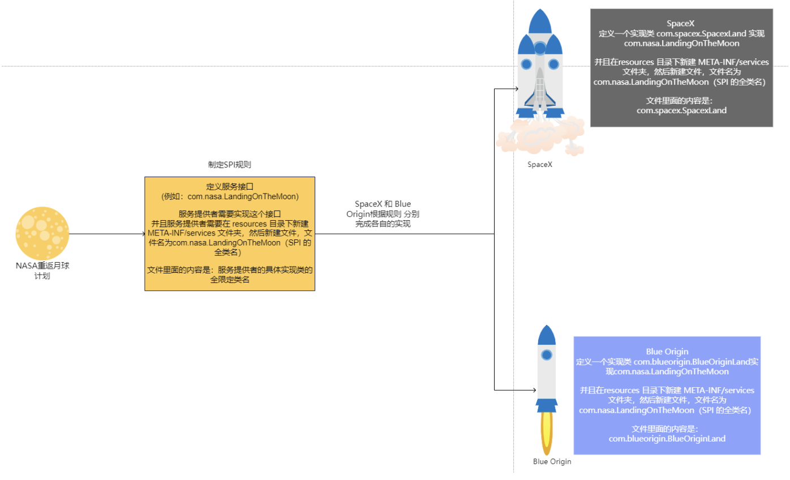

# 
SPI

> SPI(Service Provider Interface) 是 Java 提供的一种服务提供者接口，用于实现服务的扩展。

`SPI` 机制是一种服务发现机制，它通过在 `META-INF/services` 目录下提供一个接口的实现类来实现服务的扩展。可能理解起来比较抽象，我们这里通过和`API`来进行对比来理解。

## API 与 SPI
> 什么是API?

`API` (Application Programming Interface)是应用程序接口，是一种软件的接口，用于不同软件之间的通信。`API` 通常是一组预定义的函数，类或方法，用于访问软件的功能。`API` 可以是操作系统的 `API`，库的 `API`，或者是 `Web` 服务的 `API`。

而对比的来看，`SPI` 是(Service Provider Interface). 他们的主体是刚好相反的。前者是由使用者定义的，后者是由服务提供者定义的。

一个很简单的例子，我们在考虑NASA在招募各个公司来实现一个火星探测器的返回地球的后续工程，招标。假设，我们有两家公司来进行招标。

首先是API :
两家公司，各自提供了一个接口，用于实现火星探测器的返回地球的工程，但是接口是由两家公司来提供。倘若NASA选择了其中一家公司，那么NASA就需要使用这家公司提供的接口来实现火星探测器的返回地球的工程。让自身的系统修改过后可以适配选中的这家公司的接口。要进行比对的话，就必须的多次修改自己的系统来适配各个公司的接口。

其次是SPI :
因为NASA 作为招标的甲方，它并不认同这样来实现。而变成了让各个招标公司在基于NASA的给定标准下，来进行接口的设计。这样的好处就是，NASA只需要提供一个标准，其他的招标公司必须按照这个标准来进行接口设计。不需要每次的修改自己的系统来适配各个公司的接口。很典型的例子就是，Java提供的 `JDBC` 接口，各个数据库厂商来实现这个接口，这样的好处就是，我们只需要修改配置文件，就可以切换不同的数据库。

## RPC 中的SPI机制
我们在实现`RPC`框架的时候，举一个简单的例子就是`Serializer`的实现，我们可以使用`SPI`机制来实现。既可以在框架内部选择实现既定提供的序列化接口，同时我们也可以自定义实现序列化接口。

