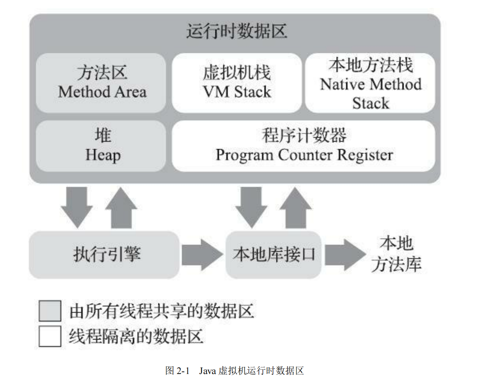
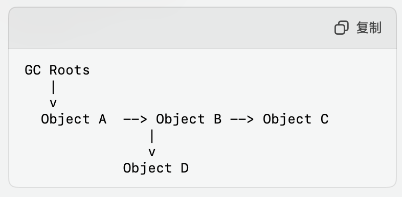

# <center>内存与垃圾回收</center>


## GC Introduce 
首先是 JVM 中的内存分布区域与 GC 关系最为紧密的部分是 **堆** 和 **方法区**



### 触发GC的条件是什么

- 内存不足时 JVM检测到堆内存不足的时候，就会自动触发GC
- 手动请求，可以利用 `System.gc()` 或者 `Runtime.getRuntime().gc()` 进行建议 JVM 进行垃圾回收 -> 是建议并不会立即执行
- JVM 参数的设置
- 对象数量或者内存占用达到阈值的时候


### JVM中的内存组成

#### JVM 中的堆 

- 主要的储存对象 : **对象实例** 和 **数组** （所有动态内存分配等对象都是储存在堆中）
- 是 GC管理的主要区域，几乎所有的Java对象都在这里分配内存
  
    - 分成 **新生代** 和 **老生代**


#### JVM 中的方法区

- 用于储存 **类信息**、**常量**、**静态变量**、**即时编译器编译后的代码**等数据
> 在 HotSpot 虚拟机中对应的是**元空间**,元空间也受到GC管理，但是回收频率和方式与堆不同

#### JVM 中的栈

- 是每个线程独有的，存放局部变量表、操作数栈、动态链接等信息
- 不属于 GC 管理的主要部分，因为栈帧随方法的进入和退出自动清理

#### PC
> 与GC无关
每个线程中都有一个 PC 寄存器，用来储存线程所执行的字节码的行号指示器


我们看上图，可以发现的是 **堆 和 方法区** 两个都是所有线程共享的，而 **栈 和 PC** 是每个线程独有的。


### GC 的基本原理

因为Java的JVMGC是自动进行垃圾回收的，那么很自然的一个想法就是，我们如何知道一个对象是不是垃圾呢？那么接下来就是介绍一下 **GC是如何判定对象是否存活**

#### 对象是否存活的判定

##### 1. 引用计数法

我们给每个对象添加一个引用计数器，用来统计这个对象被引用的次数。当引用次数为 **0** 的时候，就进行回收。看起来是一种比较理想的办法，但是有一种特殊情况是 **循环引用**，这种情况下，两个对象互相引用，但是引用次数都不为 **0**，这样就会导致内存泄漏。

下面就是一个例子:
```java
class A {
    B b;
    
    public A(B b) {
        this.b = b;
    }
}

class B {
    A a;
    
    public B(A a) {
        this.a = a;
    }
}

public class Main {
    public static void main(String[] args) {
        A a = new A(null);
        B b = new B(a);
        a.b = b;

        // 现在 a 和 b 互相持有对方的引用
    }
}
```

A 和 B 互相持有了两个对象的引用。但是没有别的地方引用，它们的引用计数一直是 **1**，就导致系统无法判断两个对象是否应该被回收，从而造成了内存泄漏。

##### 可达性分析法

> 可达性分析法是 Java 垃圾回收机制中用来判断哪些对象是可回收的一个重要的算法，它是现代垃圾回收器中使用的主要垃圾回收算法之一。

其实这个思路很简单，算法的本质就是建立有向图，从 **GC Roots** 开始，遍历所有的对象，如果一个对象没有被任何引用指向，那么这个对象就是垃圾对象。这个算法就是 **可达性分析法**。接下来我们进行具体的介绍。

- 建立有向图
- 从 **GC Roots** 对象开始 BFS / DFS 遍历
- 垃圾回收

可达性分析的具体过程如下:

- Step1 : 确定 **GC Roots** 

    **GC Roots** 主要包括:

    - 栈中的局部变量 正在执行的线程中的栈帧的局部变量和方法参数
    - 静态字段 : 类加载器的类的静态字段的引用对象
    - JNI 引用 : 由本地代码创建的引用，指的是 Java 与其他语言的交互机制，允许在 Java 代码中调用本地方法 (主要是防止如果本地代码通过JNI持有了Java对象，但是 JNI 本身并没有直接参与JVM的垃圾回收机制，那么这部分引用可能会导致GC无法正确识别这些对象是否仍然被使用)
    - 活跃的线程 : 仍然存活的线程

- Step2 : 遍历对象图

    从 **GC Roots** 开始遍历图，逐个标记所有可达到的对象。在这个过程中，我们会把所有的对象都标记为 **可达对象**，而没有被标记的对象就是 **垃圾对象**。

    - 如何判定一个对象是否可达？

        **引用链:** 通过对对象引用链的分析，检查该对象是否能够通过一系列引用路径被 **GC ROOTs** 访问到。

        **根对象:** 所有可达对象都可以追溯到 **GC Roots**，如果一个对象不能被 **GC Roots** 访问到，那么它就是不可达的。其实两个是一样的意思。


- Step3 : 垃圾回收

    在标记完成之后，我们就可以进行垃圾回收了。我们会把所有的 **垃圾对象** 进行回收，释放内存空间。




上面就是一个可达性图分析的例子，我们很自然的可以看到，上面的引用计数法中提到的 循环引用 的反例就会被有向图给识别出来，因为没有别的对象对它俩进行引用。属于是不可达的，因此我们可以把它们标记为垃圾对象。


当然，这个算法也是有优缺点的 :

- 优点 : 
    - 准确率高，只会标记真正不可达的对象，不会漏掉任何一个对象
    - 处理复杂的引用关系, 可以避免出现的上述环形引用的问题
- 缺点 : 
    - 效率低，因为需要遍历所有的对象，所以时间复杂度是 **O(n)**
    - 需要更多的内存空间，因为需要记录所有的对象的引用关系，所以需要更多的内存空间

### 常见的垃圾回收算法


#### 标记-清除算法(Mark-Sweep)

- 过程 : 就像上面所说的一样，我们标记所有存活的对象 -> 清除所有未标记的对象。
- 优点: 是实现简单，标记和清除过程都是可以分离的独立过程。
- 缺点: 缺点也很明显，就是会出现比较多的内存碎片，导致内存的利用率降低，同时也会导致 GC 的效率降低。


#### 标记-整理算法(Mark-Compact)

- 过程 : 标记所有存活的对象 -> 将所有存活的对象向一端移动 -> 清除所有未标记的对象。

- 优点 : 其实也就是把存活的对象都移动到堆的另一端，从而释放掉对象之间的空闲内存。我们可以通过这种方式，避免了上面的标记-清除算法中出现的可能过多的内存碎片的问题。

- 缺点 : 需要额外的对象移动开销。就是一个 trade-off 的问题。


#### 复制算法(Copying)

- 过程 : 我们把内存分成大小相等的两块，只使用其中的一块，回收时候，将存活的对象复制到另一块中，然后清除掉原来的内存块。
- 优点 : 没有内存碎片，分配效率高
- 缺点 : 缺点也很明显，可用的内存减半，同时大量的内存copy开销


#### 分代收集算法

主要的思想其实很简单，就是一生一策。根据对象存活时间不同的特点，分成 **新生代** 和 **老生代** 

- **新生代** 就是那些存活率比较低的对象，不会长时间存活的
- **老生代** 存放长期存活对象，存活率比较高

那么对于不同的生代，我们就可以选用不同的回收算法来进行处理。

- **新生代** : 一般使用 **复制算法**，因为新生代的对象存活率比较低，所以我们可以通过复制算法来进行回收，同时也可以避免内存碎片的问题。

- **老生代** : 一般使用 **标记-整理算法**，因为老生代的对象存活率比较高，所以我们可以通过标记-整理算法来进行回收，同时也可以避免内存碎片的问题。