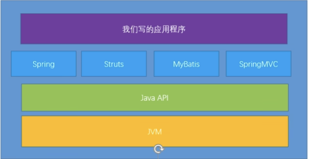

# 
Introduce
 
## 为什么要学习 JVM

程序员太关注上层，但是忽略了下层的JVM.
我们把上层的 `API` 库的调用看成是数学公式，那么 `JVM` 的调用就好像是数学公式的计算过程。 

1. 面试需求
2. 中高级程序员的必备技能

    项目管理，调优需要

3. 追求极客精神

    了解底层的东西，才能更好的理解上层的东西。

## 架构师每天都在关心什么？

- 应该如何让我们的系统更快
- 如何避免系统出现崩溃/瓶颈

