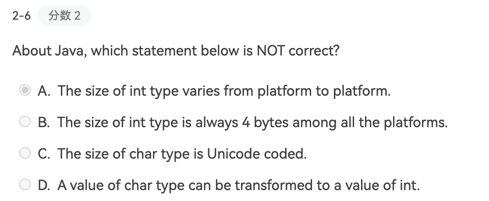
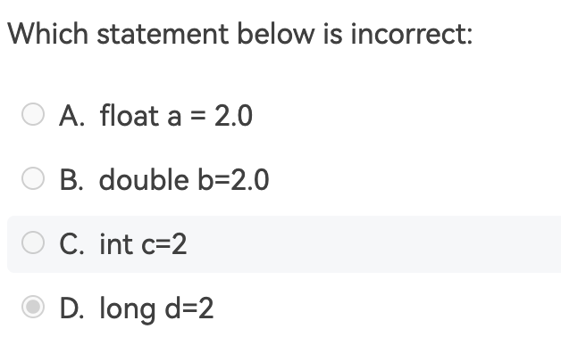
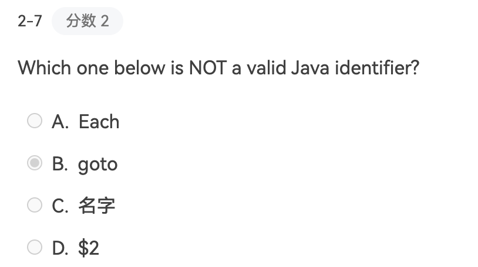
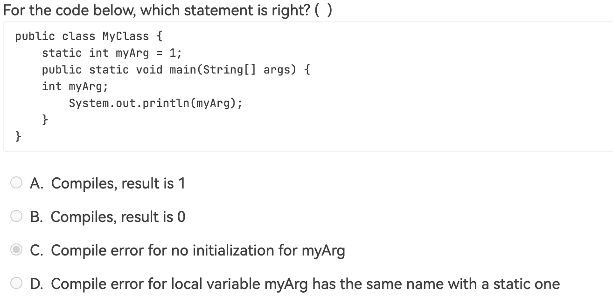
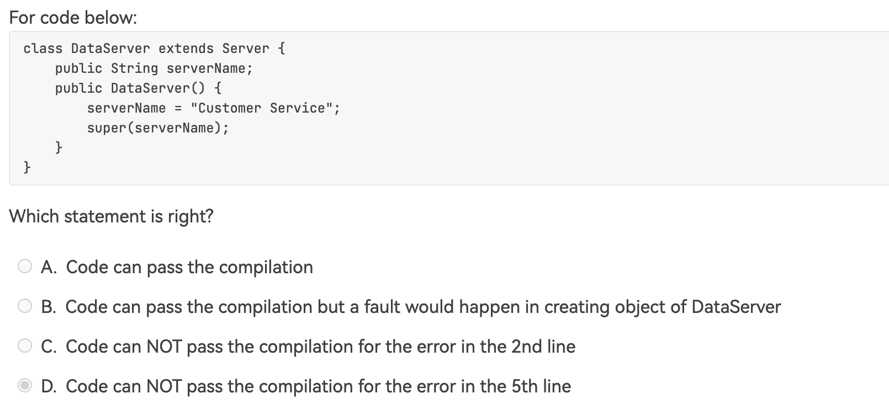
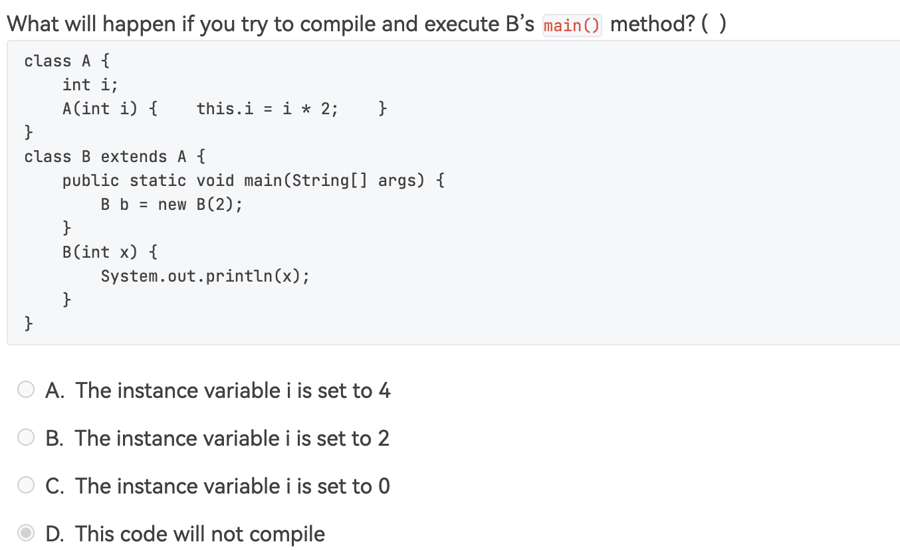
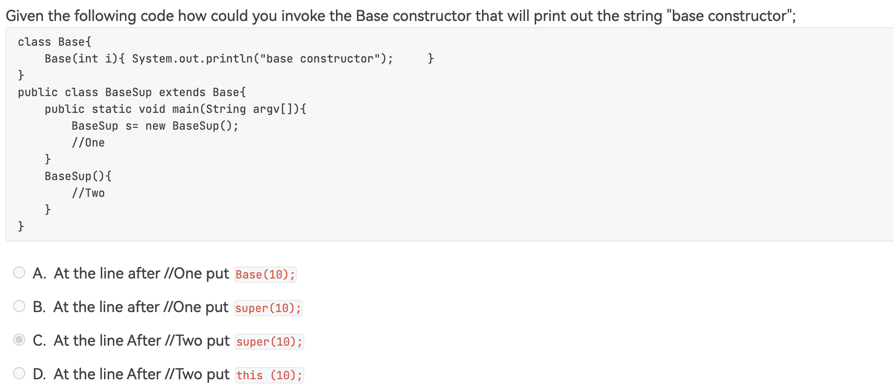
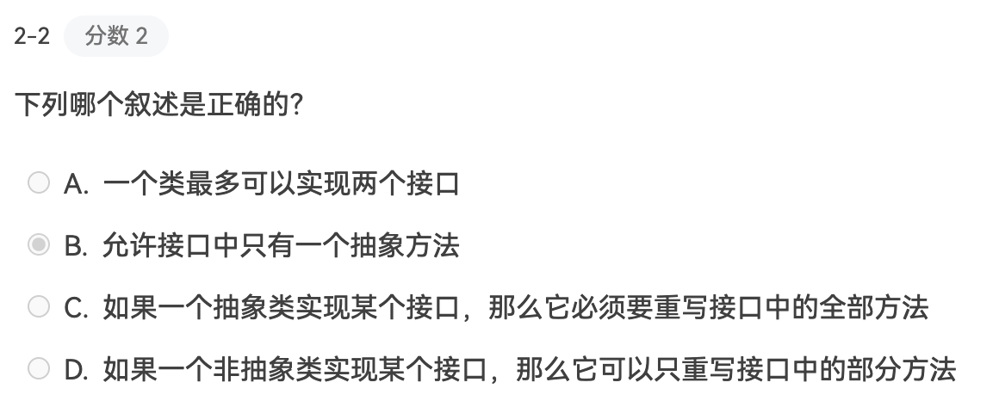
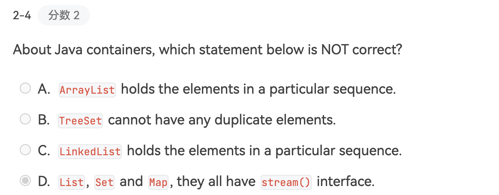
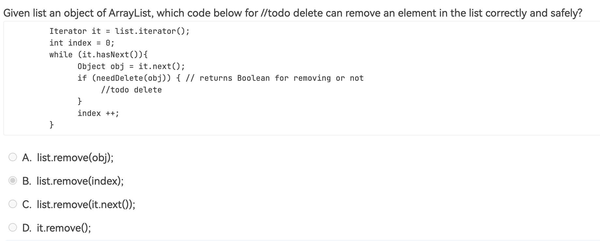

# <center>易错点总结</center>
> 这一部分来自于 浙江大学 Java 课程的作业中的易错点总结，仅供考试复习使用。

## 判断题
- **[T] `Java` 的字符类型采用的是 Unicode 编码的方式，每个Unicode字符占用两个字节。**
- **[T] `Java` is a `type-safe` language.**
  > 什么是 `type-safe` ?
  是指在编译和运行的时候，能够确保变量只能存储和操作与其类型一样的数据，可以防止类型错误！

- **[F] compiled Java program can be executed on any operating System.**

    准确的来说, compiled Java program 是指 `javac`指令了之后，生成的可以在各个操作系统的`JVM`中运行的字节码文件。所以这个说法是错误的。 

- **[T] Objects created in Java do not need to be deleted or freed by the programmer**

- **[T] Member variables are to get default init values when the object is to be created.** 

    `Java` 中需要注意的是，它会尽量的避免变量未初始化的情况，因此会给变量赋予默认值。

- **[F] Some Java objects are put in the heap, while some are in stack.**

    `Java` 中的对象都是在堆中分配的，而不是在栈中分配的。栈上分配的都是方法调用的局部变量和方法调用帧。

- **[F] A Java class can extend from multiple base classes.**

    `Java` 中的类是不支持多继承的，只能继承一个类，但是可以实现多个接口。
    
    记得区分 `extends` 和 `implements` 的区别，前者是继承类，后者是实现接口。

- **[F] `protected` can be used to prevent methods and data been accessed from non-derived classes**

    `protected`修饰符的作用 详细见 以一言蔽之就是可以让同一个包中的类访问，同时也能让子类访问。
    <a href = "https://www.magnus031.top/NoteBooks/Tutorial/Java/Java4/#433-dissecting-the-employee-class:~:text=class(%E8%A1%8D%E7%94%9F%E7%B1%BB)-,protected,-%3A%20The%20keyword%20Make">作用</a>


- **[T] 接口和类不同，不具有单继承性，它可以继承多个接口。**

    接口要和类区分开来

- **[T] 接口不允许被 `private` 或 `protected` 修饰符修饰。**

    只可以是`public`,不过默认是`public`,所以不用声明

- **[F] 接口可以继承自一个接口或多个接口，也可以继承自抽象类。**
    ```java
    public abstract class Shape{
        private String color;
    }
    ```
    可以用多态来理解抽象类。抽象类是不能被实例化的类，也就是不用利用`new`来创建的。


- **[F] There is a `length()` method for all the arrays to represent the number of elements**

    事实上，数组是没有`length()` 方法,应该是`length`属性。

- **[T] To pass one row of a double-subscripted array to a method that receives a single-subscripted array, simply pass the name of the array followed by the row subscript.**
    
- **[T] 当一个方法在运行过程(runtime)中产生了一个异常，则这个方法会被终止，但是整个程序不一定被终止运行**

- **[T] 所有二进制I/O的根类都是 `InputStream`类 和`OutStream`类，同时是以字节为单位的**

    every date read and write `8bit`

- **[F] ArrayList 类是线程安全的**

    `ArrayList` 是线程不安全的，如果需要线程安全的话，可以使用 `Vector` 或者 `Collections.synchronizedList` 来进行包装。但`Vector`应该是不推荐使用的。

- **[F] 静态方法不能使用`synchronized`关键字来修饰**

- **[F] 在Java中，高优先级的可运行线程会抢占低优先级线程。**

    在Java中的线程调度是**不确定**的，只能说高优先级的线程会有更多的机会被调度，但是不能说一定会抢占低优先级的线程。

- **[F] 程序开发者必须创建一个线程去管理内存的分配.**

    `Java` 中的内存管理是由`JVM`来进行管理的，程序员不需要关心内存的分配和释放。

- **[F] 当调用一个正在进行线程的stop()方法时，该线程便会进入休眠状态。**

    `stop()`方法是用来终止一个线程的，而不是让线程进入休眠状态。但这个方法已经被废弃了，不推荐使用。

- **[T] StringBuffer类是线程安全的，StringBuilder类是线程不安全的。**

    `StringBuffer` 是线程安全的，`StringBuilder` 是线程不安全的。

- **[T] HashSet类是线程不安全的**

- **[F] All threads defined in one program are to be executed in one CPU concurrently.**

    `Java` 中的线程是由`JVM`来进行调度的，不是由`CPU`来进行调度的。

- **[F] J20 When the interrupt() method interrupts a thread, the thread will throw an InterruptedException immediately.**

    `interrupt()`方法是用来中断一个线程的，但是不会立即抛出`InterruptedException`异常。

- **[F] The `notify()`, `notifyAll()` and `wait()` are methods of class Thead.**

    `notify()`, `notifyAll()` and `wait()` 是`Object`类的方法，而不是`Thread`类的方法。

- **[F] 线程让步可以通过调用`sleep()` 方法**

    `sleep()`方法是用来让线程休眠一段时间，而不是让线程让步。想让线程让步可以使用`yield()`方法。

- **[F] All strings are terminated with a `null`('\0') character**

    要与 c/cpp 区分开来，`Java` 中的字符串不以`null` 结尾

- **[T] The member inner class can access all data member of the outer class.**

- **[T] A listener can be register into several sources**

    这个很好理解，就是一个监听器可以监听多个事件源。

- **[F] A private method can be overridden by its subclass**

    这个就是需要理解 `public` 和 `private`的本质了，对于`private` method来说，是对其他类都**不可见**，那么你的子类怎么可能重写这个方法呢？

- **[F] For `final int[] ar = new int[10]` we cannot modify the content of the array.**

    `final` 修饰的是引用，而不是引用指向的对象。所以这个数组是可以被修改的。但是它不能指向其他的对象。也就是直接赋值的时候不能指向别的对象了。

- **[F] `String s1 = new String("Hello");String s2 = new String("Hello");System.out.println(s1==s2)` the output answer is true**

    In Java,the `==` operator checks for reference equality when used with object references. This means it checks whether both references point to the exact same object **in memory.**
## 选择题

- 

    

-  The answer is `A`.

   
   
在`Java`中，`2.0`是一个双精度浮点数，如果要将`2.0` 赋值给一个`float`类型的变量，需要在数字后面加上`f`或`F`来表示这个是一个单精度浮点数。
所以正确的写法应该是 `float f = 2.0f;`

-  

    

什么是 `Java`的 `identifier` 这里要和`keyword`进行区分，`identifier`是指的是在`Java`中的变量名，方法名，类名等等。而`keyword`是`Java`中的关键字，比如`public`，`static`等等。上题中的 `goto` 是`Java`中的关键字，所以不能作为`identifier`。


- 
    
      

这里区分两个概念，`局部变量` 和 `实例变量`。在`main`方法中，声明了一个局部变量，`int myArg`，这会屏蔽掉类变量`myArg`.在Java中，局部变量是优先于实例变量的。所以这题实际上是在访问局部变量`myArg`，而不是类变量`myArg`。

- 
    

`super(serverName)`的方法是调用父类的构造函数，但这里错在这个语句必须放在第一行，因为在`Java`中，如果没有显示的调用父类的构造函数，那么`Java`会默认调用父类的无参构造函数。所以这里的`super(serverName)`必须放在第一行。


- 
    

这题和上述类似，主要是面向的问题是`Java`中的子类父类的构造函数问题，如果父类没有无参构造函数，那么在子类中必须显性的声明调用父类的构造函数。而上图中的父类只有`A(int i)`这样一个构造函数，所以B类中必须在字节的构造函数中显性的调用父类的构造函数。`super(i)`
所以出现了编译错误.下述代码是正确的。
```java
class A {
    int i;
    A(int i) { 
        this.i = i * 2; 
    }
}

class B extends A {
    public static void main(String[] args) {
        B b = new B(2);
    }

    B(int x) {
        super(x); // 调用父类 A 的构造函数
        System.out.println(x);
    }
}
```

- 
    

这题就是呼应了上一题，不再多赘述

- 
    

这里就讲一下什么是抽象方法,带有关键词`abstract`。在接口中只能有一个抽象方法。目的主要是为子类提供一个必须实现的模板，强制子类重写该方法。

它具有的特点：
1. 必须以分号结尾`;`
2. 没有方法体，只有声明
3. 需要带有`abstract`关键词


- 

    

这一题中的 `List` 和`Set` 是继承了`collection`接口，所以有`stream()`的接口，但是`map` 没有继承`collection`的接口，所以没有`stream()`的接口。


- 这题选 **D**

    

在iterator中只有`it.remove()` 删除当前元素是线程安全的，同时不会破坏iterator的结构。


## 程序填空题
<style>
img {
  display: block;
  margin-left: auto;
  margin-right: auto;
  width : 90%;
  border-radius: 15px; /* 将图片设置为圆形 */
  
} 
</style>