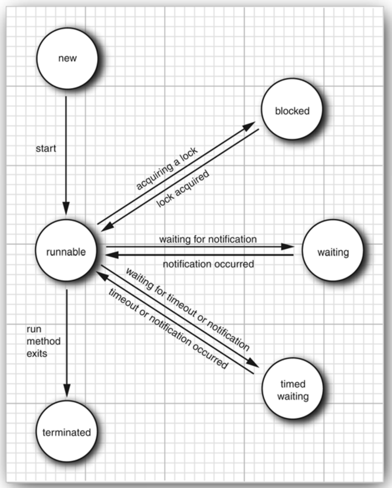
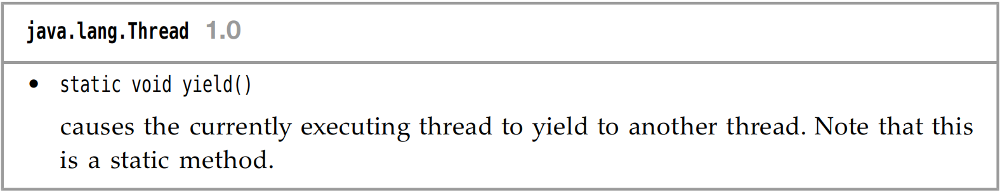
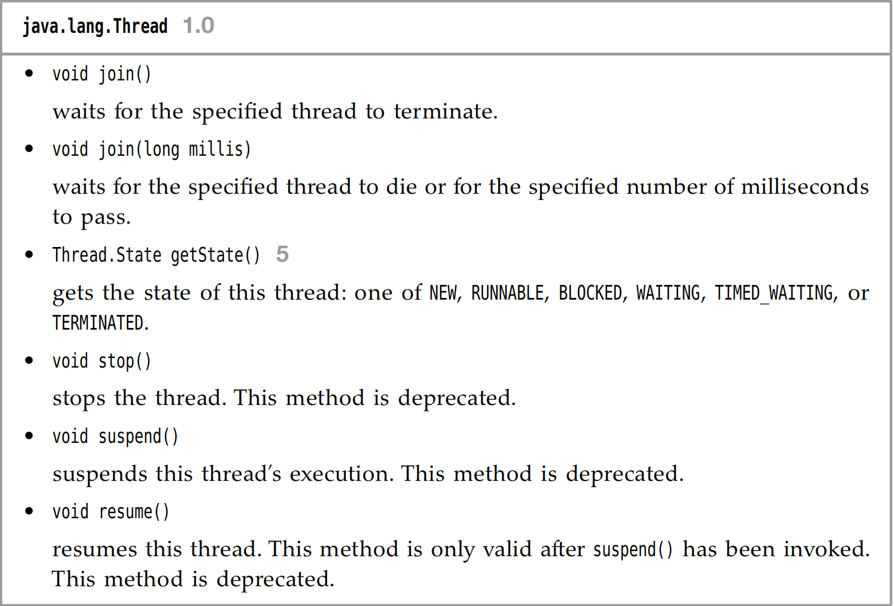
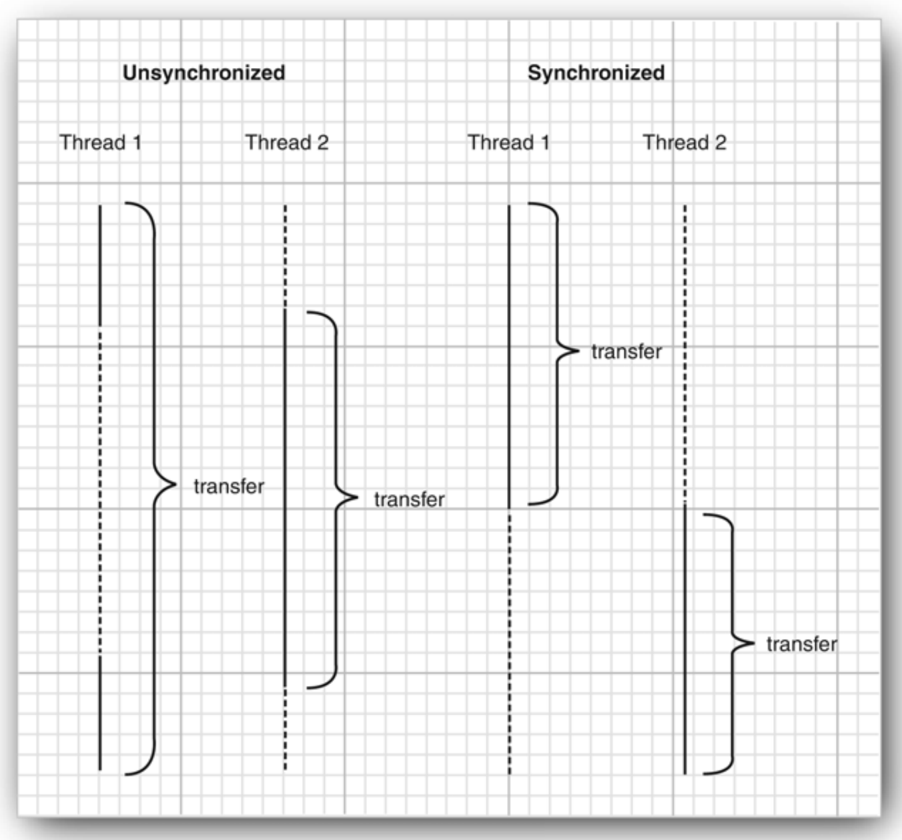
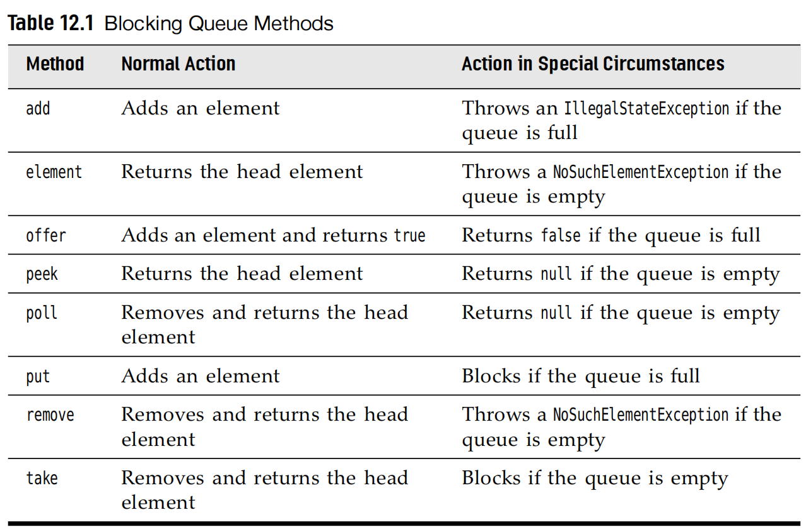

# <center>Chapter12 Concurrency</center>
> Concurrency 本章主要讲的是线程，高并发的内容比较重要
>
> This Chapters will talk about the topic of **Multitasks**
>


多进程和多线程的区别是什么呢？

- 每个进程具有完整的一套自己的变量集合
- 每个线程之间是共享数据的，从而方便他们进行有效率并且更容易的进行交互比起多进程之间的交互。
- 多线程是很常见的，举个例子，当一个浏览器需要具有同步下载多图片的能力，一个网络服务器具有服务并发的需求的能力。

## 12.1 What are threads?

Here is the following code block to take a short look of `thread`;

```java
Runnable r = ()=>{
    try{
        for (int i=0;i<STEPS;i++){
            double amount = MAX_AMOUNT * Math.random();
            bank.transfer(0,1,amount);
            Thread.sleep((int)(DELAY*Math.random()));
        }
    }catch(InterruptedException e){

    }
}

var t = new Thread(r);
t.start();
```

首先，我们来看 `Runnable r = ()=>{// task code}` 这个是一个`Lambda` 函数，其中 `Runnable` 是一个函数接口，可以用这个来创造一个线程的实例。

```java
// you can also define the thread by its subclass of the thread class.
class MyThread extends Thread{
    public void run(){
        // task code;
    }
}
```

## 12.2 Thread States
Threads can be 6 states:

- New 
- Runnable
- Blocked 
- Waiting
- Time Waiting
- Terminated



`New Threads`:

When You create a thread with `new` operator before `start`. It indicates that the thread is not running yet.

`Runnable Threads`:

After I use the `start` method, the thread is in the `runnable` state.
> 注意，但是处于 `runnable` 阶段的线程，不一定时刻在`running`.这取决于操作系统给他分配的资源调度，是否当前是这个线程在跑。也可能处于 `waiting` 和 `blocked` 阶段。

>The following 2 states are `blocked` and `waiting`: They are temporarily inactive. They does not execute any code and consumes minimal resources.
两者有个区别就在于是 `被动` 还是 `主动`

`blocked`:
阻塞态，其实就是在该线程想获取锁的时候，但是发现锁被其他线程所占用了，这个时候就应该进入阻塞态了，等其他线程的锁完全释放的时候，才能获取锁，从而离开`blocked`.

`waiting`:
When the thread waits for another thread to notify the scheduler of a condition.
以一言蔽之，就是说当某个线程在**主动**等待某个条件满足的时候，直到被其他的线程明确的唤醒

- 线程通过 `Object.wait()` 或者 `Thread.join()` 进入 `waiting` 状态
- 线程必须等待另一个线程通过 `notify()` 或 `notifyAll()` 唤醒
- `waiting` 状态不会占用CPU时间

`time waiting`
There are several methods that have a timeout parameter.Calling them causes the thread to enter the **timed waiting** state.

`terminated`

- It dies a **natural death** because the `run` method exits normally.
- It dies abruptly because an **uncaught exception** terminates the `run` method.

### Some methods



## 12.3 Thread Properties

### 12.3.1 Interrupting threads
> The following Java release version stops the `stop()` and `suspend()` method.
>
> But with the replacement of using `interrupt()` method. Or the `return` statements in the `run` method body.

- The `blocked` status thread can not be checked by `Thread().currentThread().isInterrupted()` . Take the place of it , we will use `InterruptedException()` to terminated the `blocked` thread.

```java
// Here is the example:
Runnable r = () -> {
 try
 {
    . . .
    while (!Thread.currentThread().isInterrupted() && more work to do)
    {
        // do more work
    }
 }catch(InterruptedException e){
 // thread was interrupted during sleep or wait
 }finally
 {
    // cleanup, if required
 }
 // exiting the run method terminates the thread
};
```

If you call the `sleep()` method.Do not use the `isInterrupted()` to check.

### 12.3.2 Daemon Threads
A daemon thread is simply a thread that has no other role in life than to serve others.`timer` is the thread that sends regular `timer ticks` to other threads or threads that clean up stale cache entries.

### 12.3.4 Handlers for Uncaught Exceptions
 there is no `catch` clause to which the exception can be propagated.
Instead, just before the thread dies, the exception is passed to a handler for
uncaught exceptions.

You can install a handler into any thread with the `setUncaughtExceptionHandler()` method.

### 12.3.5 Thread Priorities
`setPriority()`
In the Oracle JVM for Linux, thread priorities are the same!


## 12.4 Synchronization 同步
### The race condition 竞态冲突
> from the `wiki` reference:
>
> A race condition can arise in software when a computer program has multiple code paths that are executing at the same time.** If the multiple code paths take a different amount of time than expected, they can finish in a different order than expected, which can cause software bugs due to unanticipated behavior. **A race can also occur between two programs, resulting in security issues.

> Critical race conditions cause invalid execution and software bugs. Critical race conditions often happen when the processes or threads depend on some shared state. Operations upon shared states are done in critical sections that must be mutually exclusive. Failure to obey this rule can corrupt the shared state.

### Lock Objects

```java
myLock.lock();
try{
    // critical section;
}finally{
    myLock.unlock();
}
```

This construct guarantees that there only one thread at a time can enter the critical section. No other thread has the chance to get past the `lock` statement.



### 12.4.4 Condition Objects
我们经常会发现有些时候，一些线程在进入`critical section`的时候，当且仅当满足某种条件的时候，因此我们这里引入一个 `condition object` 来管理那些获得锁，但是不能正确的完成工作的线程。


下面举了一个例子，那就是当银行只有盈利的时候，才能让其他用户取钱。如果不盈利，就一直处于僵持状态，需要等待别的线程来让它增加收入，但别的线程又无法进行，就陷入了僵局。此时就引入了`condition objects`.

```java
public void transfer(int from, int to, int amount)
{
    bankLock.lock();
    try
    {
        while (accounts[from] < amount)
        {
        // wait
        . . .
        }
        // transfer funds
        . . .
    }
    finally
    {
        bankLock.unlock();
    }
}

class Bank
{
 private Condition sufficientFunds;
 . . .
 public Bank()
 {
 . . .
 sufficientFunds = bankLock.newCondition();
 }
}
```
当 `transfer` 发现`sufficient funds` 不可得的时候，那么就会 `sufficient.await()`.当前线程就会被迫放弃这个锁，让其他的线程可以进入`critical section`.

> There is an essential difference between a thread that is waiting to acquire
a lock and a thread that has called `await`. Once a thread calls the `await` method,
it enters a `wait set` for that condition. The thread is not made `runnable` when
the lock is available. Instead, it stays deactivated until another thread has
called the `signalAll` method on the same condition.

`sufficientFunds.signAll()` 的作用是唤醒所有在`waiting list` 中的线程

```java
// One example
public void transfer(int from, int to, int amount)
{
    bankLock.lock();
    try
    {
        while (accounts[from] < amount)
            sufficientFunds.await();
        // transfer funds
        // . . .
        sufficientFunds.signalAll();
    }
    finally
    {
        bankLock.unlock();
    }
}

```

拱手让出，以免陷入僵持状态。


#### `synchronized` 关键字
`synchronized` 关键字的主要作用是**控制线程对共享资源的访问**，确保在同一时刻只有一个线程能够访问被同步的方法或代码块，从而避免线程安全问题

你可以直接使用 `synchronized` 关键字 
```java
// code block 1 
public synchronized void method(){
    // method body;
}

// code block 2
public void method(){
    this.intrinsicLock.lock();
    try{
       // method body;
    }
}
```
上面两段 code block 是等价的，我们用 `synchronized` 关键字来等价的完成这一操作，让只有一个线程可以调用这个方法。

在上面那么多铺垫之后，我们就能很自然的理解下面这段代码了。
```java
class Bank
{
    private double[] accounts;
    public synchronized void transfer(int from, int to, int amount) 
    throws InterruptedException
    {
        while (accounts[from] < amount)
            wait(); // wait on intrinsic object lock's single condition
        accounts[from] -= amount;
        accounts[to] += amount;
        notifyAll(); // notify all threads waiting on the condition
    }
    public synchronized double getTotalBalance() { . . . }
}
```

`wait()` 和 `notifyAll()` 就分别是将线程加入 `waiting list` 和 唤醒所有在 `waiting on the condition threads`.

### 12.4.6 Synchronized Blocks
> Another way to enter acquiring the lock;

锁对象的设置，我们在同步块的时候，定义了锁对象`private Lock lock = new Object()`,后续我们也利用了`synchronized (lock)` 进行对锁对象的同步设置。

主要是这样可以更加的灵活进行锁的对象的设置

- `this`
- `class `
- `lock` 自定义的锁对象

### 12.4.7 The monitor concept
> The powerful tools to make multithreading safe without forcing programmers to think about explicit locks.

- `monitor` 是 JVM 内置的锁，每个Java对象都有一个隐式 `monitor`
- 只有一个线程可以持有对象 `monitor` 其他线程就会进行 `block`，自动加入 `waiting list`
- 线程退出 `synchronized` 块的时候，释放`monitor`

### 12.4.8 volatile modifier

- 保证了线程之间的可见性 (Visibility)
  
    当一个线程修改了`volatile` 变量的值，其他线程能立刻看到这个更新

- 防止指令的重排 (Reordering)

    就像在操作系统中线程之间的同步的时候所说，有时候编译器(这里应该是 CPU && JVM) 会对指令进行重拍，导致会出现一些上锁的错误


### 12.4.9 Final Variables 
There is one situation that we no use `lock` or the `volatile` modifier, that it is safe to access a shared field when We use `final`.

`final var accounts = new HashMap<String, Double>()`

如果没有 `final` 这个量词，我们无法保证多线程可以安全的看见 `accounts` 的更新。

### 12.4.10 Atomics
操作的原子性 操作系统中有介绍，不做过多赘述

### 12.4.11 Deadlocks 
死锁 操作系统中有介绍，不做过多的赘述


## 12.5 Thread-safe collections

### 12.5.1 Blocking Queues
`blocking queue` 阻塞队列是Java提供的一种线程安全的数据结构。主要是用于解决多线程环境下的生产者-消费者问题。

- `Block queue push`
    当队列已经满的时候，生产者（试图往队列中添加元素的对象）会进入`block`状态，等到队列未满的时候再进行填入。

- `Block queue pop`
    当队列空的时候，消费者（试图往队列中取出元素的对象）会进入`block`状态，等到队列中有元素的时候才会填入。


#### Advantages

- `Producers and Consumers`
    1. 生产者线程将数据放入队列，消费者线程从队列中取数据
    2. `blocking queue` 可以自动的平衡数据流，在生产者过快，消费者过慢点时候形成一个`balance`.



### 12.5.2 Efficient Maps, Sets and Queues

我们可以使用 `java.util.concurrent` 包中的一些数据结构 `ConcurrentHashMap`,`ConcurrentSkipListSet`,`ConcurrentLinkedQueue`.

> The concurrent hash map can efficiently support a large number of readers and a bounded number of writers.

### 12.5.3 Atomic update of map entries

引入了 `map.compute(word,(k,v)->v == null ? 1 : v+1)` 的原子操作，避免了旧版本的 `replace` 的使用.


<style>
    img{
        margin-left : auto;
        margin-right: auto;
        display:block;
        width:80%;
        border-radius:15px;
    }
</style>


