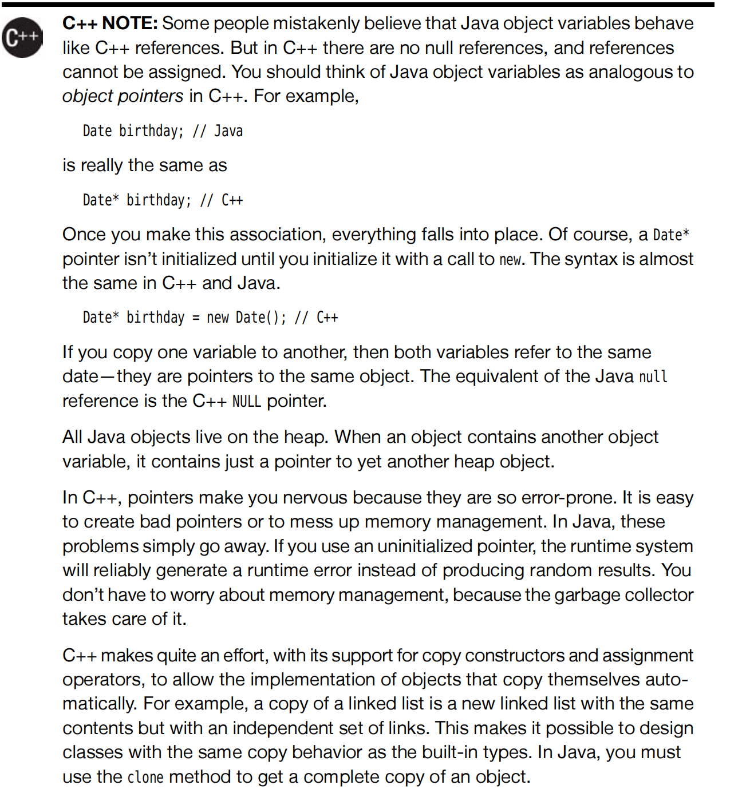
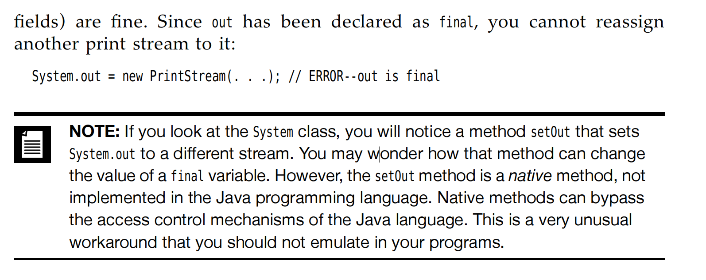
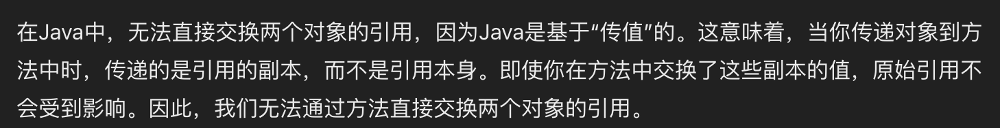
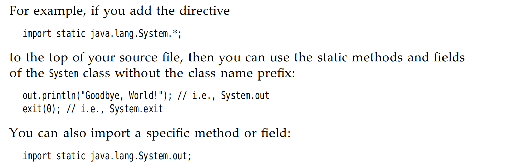
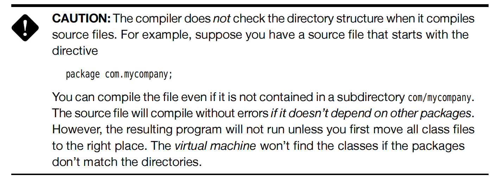

# <center>Chapter4 Objects and classes</center>

## 4.1 Introduce
## 4.2 Predefined Classes

### 4.2.1 Objects and object variables
#### constructor function
> **constructor function** is a special method whose purpose is to construct and initialize objects. 构建和初始化对象

<span style="color:red">[Tips]
All the objects constructed in the heap in Java,which means that you can only use `new` to create a object.</span>

<span style="color:red">[Tips]</span> 
What is the `toString` means?
It is a **special method** in represent this object in String type.

### 4.2.2 Create a object 
```Java
    Date deadline; // deadline doesn't refer to a object now;
    s = deadline.toString();
```
The above will cause a **compiler-time** error;
- Method1 : You should use the constructor function to let `to String` represents a object.

- Method2 : You can also let deadline refers to an existing object;



The above is the difference between **C++** and **Java** in the object referrence.

### 4.2.3 Mutator and Access Methods
> 修改方法和获取方法.

很好理解 字面意思。前者是会让某个对象进行更改/修饰，但是后者是直接获取了一个新的修改之后的对象，但是原对象不变。
```Java
    LocalDate aThousandDayLater = newYearsEve.plusDays(1000);

    someDay.add(Calendar.DAY_OF_MONTH,1000);
```
第一个是 $Access Method$ 但后者是$Mutator Method$原来的对象发生了改变。

## 4.3 Multiple source usage

### 4.3.2 Use of Multiple Source Files
> 我们这里先考虑一下类Unix系统中的`make`的逻辑，在之前写`makefile`文件中的时候，学习了一下`make`的逻辑，是将指定的一些`.h`,`.c`等目标待文件编译文件放在一起，等待如果某些`.h/.c`文件发生改动的时候，就会单独的重新将这些文件编译进，而不是整体编译。有点类似`cache`的作用。就是为了节约性能，已经编译过的未改变的内容不变。

我们在考虑Java的编译的时候，其实已经可以感受到了Java中内置了`make`。怎么呢？首先，作为典型的OOP语言，我们是将各个类写在各自的文件中，那么假设我们有两个类，`Employee.java`和`EmployeeTest.java`函数，我们在后者中使用到了前者这个类，那么编译器在编译的时候就会优先寻找有无`Employee.class`这个文件存在**便于无修改的重复利用，和上述的 make 进行呼应了**，如果没有找到的话就会选择寻找`Employee.java`并且进行编译。如果实在没有找到的话就会在`EmployeeTest.java`中寻找，然后报错。


### 4.3.3 Dissecting the Employee Class
> Several Key Words

- Public : The keyword public means that any method in any class can call this method.
    所有任何类的任何方法都可以调用这个方法。
- private : The keyword Make sure that the only methods that can access these instance fields are the methods of the inner class itself.<span style="color : red">No outside method can read or write to these method,including the Derivative class(衍生类)</span>
- protected : The keyword Make sure that the methods can be accessed by any class <span style="color : red">in the same package</span>，also including the Derivative class.


### 4.3.5 Declaring Local Variabale with var
> `var` key word is used to provided their type can be inferred from the initial value.

`Employee harry = new Employee(....);`
You can use the `var` key word that make the following code;
`var harry = new Employee(....)`
Which,you can avoid typing the type again.


### 4.3.5 Be careful with `null`!
> null represents absence of an object.

If you apply a method into the `null` object, you will run across a `NullPointerException` error. It is a serious error, if you haven't catch it,it will terminated.
So we should always care about the `null` error.

### 4.3.11 `Final` Instance Fields
> `Final` key word's meaning is as the same as final.

Which means that, this field must be initialized when the object is constructed, the value can't be change again! `immutable` !


## 4.4 Static Fields and Methods

> Simply understand is that the static method can be only one in a class. It is belong to a class, but not any individual object.

So when you access them, you **must** `Class.xxx` But not `object.xxx` 

So, combine the `final` key word, you can know that `static final`. When you use `Math.PI` as a constant, at the same time that it means `public static final double PI = 3.14....`


`Native Method` can bypass the acess control mechanisms of the Java Language.

### 4.4.5 The static Main method
In fact that The `main` method does not operate on any objects.In fact,when a program starts, there aren't objects yet.The static `main` method executes, and constructs the object that the program needs.

## 4.5 Method Parameters
- <span style = "color:red"> call by value : which means that the method gets just the value that the caller provides.</span>
- call by reference : which means that the method gets the location of the variable that the caller provides.

> Obviously, Java choose the call by value.
That means that the method gets a copy of all parameter values.The method cannot modify the contents of any parameter variable passed to it.

- Two kinds of method parameters:
  - Primitive types(numbers,boolean value)
  - Object references 对象引用
很显然，原始类型的值是无法改变的，因为值调用的原因，方法无法更改传入的值本身，因为传入的是primitive types的一个copy而已。但传入的是对象引用就不一样了。
> Actually, both the original and the copy refer to the same object!


Java本身是传值的，我们所谓的可能出现的更改引用的是由于一个很简单的逻辑。引用和被引用者都指向同一个对象，他们传入method可以对这个对象进行修改，但是我们由于在方法中传入的是copy of reference，那么修改副本所指向的对象是不能改变被引用者本身原先指向的对象的。因此，swap函数就显得不像C++中那样进行指针指向的更改了。

## 4.6 Objective Constructor
### 4.6.1 OverLoading
> some classes have more than one constrctor.This capability is called `overloading` 

- Definition:
Overloading means that if several method shares the same name, but different parameters.

> The compiler sort out the correct method with the correct types of the values. If it can't find the correct method that, it will cause `compile-time error`

> The process of finding a match is called `overloading resolution` 重载解析


### 4.6.8 Object Destruction and `finalize` Method

Many OOP Language have need the destructor function, but because of Java have automatic garbage collection, manual memory reclamation **is not needed**!


But in the real case that, some objects utilize a resource other than memory, like a file. In this case that, a `close()` method is important to cleanup.

## 4.7 Package 
### 4.7.1 Package Names
> The main reason for using package is to guarantee the uniqueness of class name.

- Why use the Internet domain name as the name of package? Because of the reason that **we assume the domain name could be unique**.

- Also there is no relations between two packages, they are independent!

### 4.7.3 Static Imports
- A form of the `import` statement permits the importing of the static methods and fields, not just classes.


### 4.7.4 Addition of a class into a package

> Package 关键字的目的就是把某个class文件归属到一个包中，不然的话，这个java文件就隶属于unnamed package了。


虽然可以编译，但是在`JVM`上运行就会出错，需要我们手动的把文件放在那个package的目录下。

## 4.8 Jar文件 Java存档文件
> What is a JAR file (Java Archive File)
- A JAR file contains multiple `class` file,and other files like **image and sound files** which have been compiled and compressed using the familiar Zip compression format, only when you need to use/include them, the `JVM` will add them into your program.
这里和package区分一下，package中是一堆`.java`文件，但是JAR包中包含的是已经编译好的`class`文件,和其他的镜像文件等被打包成了一个zip格式的文件。

> when you package your application,you want to give your user a single file, not a directory structure filled with class file.

### 4.8.1 Creating JAR files
> using the `jar` tool to make JAR files.(In the default JDK installation,it's in the `jdk/bin` directory)


### 4.8.2
> The Manifest 

In addition to class files, each JAR file contains a `manifest` file describes special features of the archive. Like the README.md file.
It is called `MANIFEST.MF` is located in a special `META-INF` subdirectory of the `JAR` file.


## 4.9 Documetation Comments
> A JDK contains a very useful tool, called `javadoc`, which generates HTML documentation from your source files.


<style>
img {
  display: block;
  margin-left: auto;
  margin-right: auto;
  width : 80%;
  border-radius: 15px; /* 将图片设置为圆形 */
  
}
</style>
