# <center>Chapter5 Inheritance</center>
> 继承

<span style = "color:red">[tips] 学完反射之后，书本给了一句很关键的话</span>
**Don't reuse Reflection** 不要滥用reflection
**The reflection mechanism lets you write programs with amazing generality, by detecting fields and methods at runtime. This capability can beextremely useful for systems programming, but it is usually not appropriate in applications. Reflection is fragile—with it, the compiler cannot help you find programming errors. Any errors are found at runtime and result in exceptions.**

反射是脆弱的，编译器无法正确的帮你找到错误！


The idea behind inheritance is that you can **create new classes that are built on existing classes(It is the natural of the Inheritance)**. When you inherit from an existing class, you reuse (or inherit) its methods, and you can add new methods and fields to adapt your new class to new situation. **This technique is essential in Java Programming.**

The Inheritance chapter also introduce the mechanism of reflection, the ability to find out more about classes and their properties in a running program.**It is a critical feature of Java**


## 5.1 Classes, Superclasses, and Subclasses
> A sentence to conclue is that a manager **is a** Employee.   **(is-a relation)**

### 5.1.1 Defining Subclasses
> use the key word **extends**

```java
public class Manager extends Employee{
    //added methods and fileds;
}
```

- A design principle is that : you place the most general methods in th superclass and more specialized methods in its subclasses.

### 5.1.2 overriding methods
> 如果说子类继承了父类的一些$fields$和$methods$。如果有些父类不具备的$methods/fields$，你可以直接添加。**但也有一种情况是，子类中的某些方法是需要重写的，或者说是实现方式不一样，那么就需要利用 override 关键字来实现这个方法的重写**

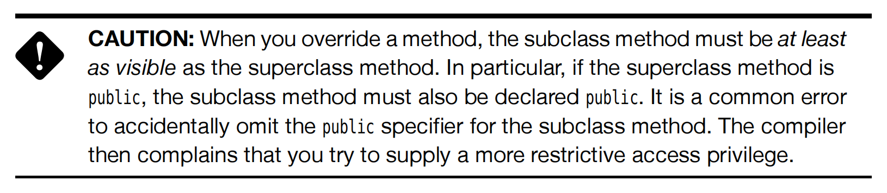

#### super 关键字
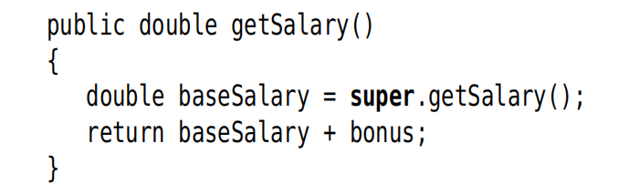
> 很好理解 `super` 关键字其实就是一个父类的引用，可以类比一下我们之前一直使用的`this` 关键字

在上面的例子中，`Salary`就是 `Employee` 类中的`private fileds` 因此我们就需要利用`super`来获取这个类中的`fields`.

<span style = "color:red">[tips] Java only support that many to one Inheritance也就是只能允许单继承，不允许多继承</span>

### 5.1.6 Method call
- Static Binding : 静态绑定
If the method is private, static, final or a constructor, then the compiler knows exactly which method to call.因为上面这些methods的属性都是确定的，不涉及可能跨类的调用，那么编译器就可以方便直接的静态绑定。但反之，`public`或者说是`protected`这种可以跨类，跨package的，你不知道什么时候会用到，就需要动态绑定(**Dynamic binding**)了.
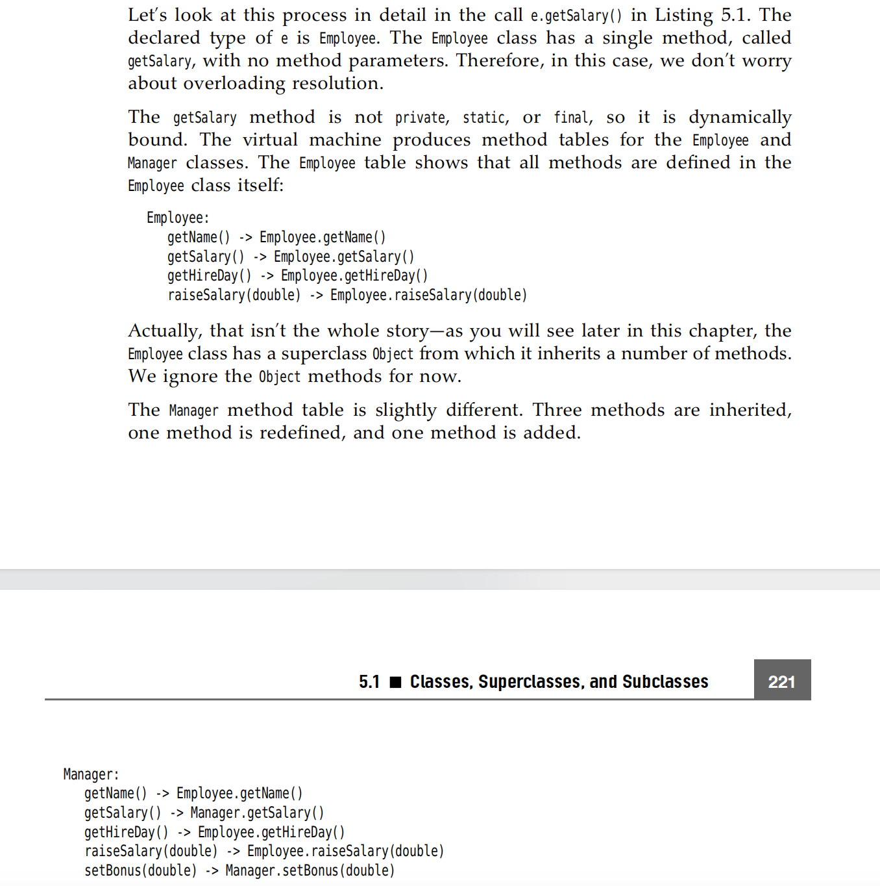
> Dynamic binding has a very important property: It makes programs extensible without the need for modifying existing code.

### 5.1.7 prevent Inheritance `final` 
every methods in `final` or `final class` will not been overridden!

### 5.1.8 Casting
> 类型转化

记住，Java是强类型的语言，也就是说不支持像C++那样的隐型转化。

- use `instanceof` 是一个好习惯，避免出现`catch exception(ClasscastException)`的情况
- Use instanceof to check before casting from a superclass to a subclass.

## 5.2 object: the cosmic Superclass
> object is the ultimate ancestor - every class in Java `extends` object.

### 5.2.2 The equals Method <span style = "color : red">Important</span>

#### Why do you need to override `equal` method?
是因为 Object 类默认的equals()方法实现的是比较对象的内存地址（即是否为同一个对象），而不是比较对象的内容

### 5.2.3 `hashCode` method
> The `hashCode` method is defined in the `Object` class.Therefore, every object has a defualt hash code.The hash code is derived from the object's memory address.

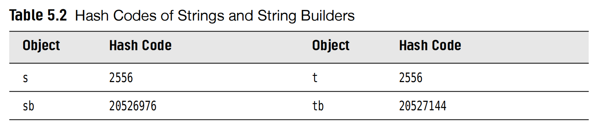

- Note that the strings s and t have the same hash code, because for strings, the hash code are derived from its content.
here `String s = "OK"`,`String t = new String("OK")`,so their hash code is the same.
- But for other object, which `hashCode` has not been defined for the class that it will only use the default `hashCode` defined in the `Object` class, which derives the `memory address`.

<span style = "color : red">Important: Why do you need to `override` the `hashCode` method after you `override` the `equals` method?</span>

这是因为在使用散列数据结构的时候，比如哈希表，我们希望相等的对象具有相等的哈希码！在Java中，哈希表使用哈希码来确定存储兑现过的位置，如果两个相同的对象具有不同的哈希码，那么他们就会被存在哈希表中的不同位置，会导致无法正确的查找这些对象。

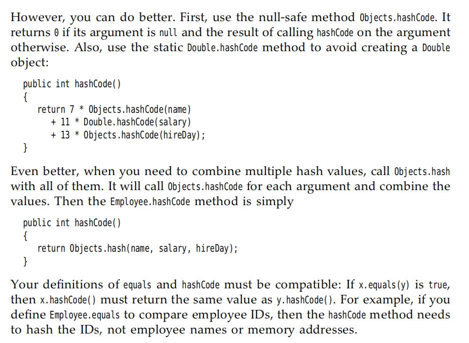

### 5.3 Generic Array Lists
> 通用数组列表

In C/C++ you have to fix the sizes of all arrays at compile time.But it is awful in sometime.Althogh Java could set size of an array at runtime like
```java
int acutalSize = ...;
var staff = new Employee[actualSize];
```
但上面的代码不能完全解决动态修改数组大小的问题。一旦确定了数组的大小，那么就是不容易更改的。所以我们考虑了 `ArrayLists`

> ArrayList class is similar to an array, but it automatically adjusts its capacity as you add and remove elements,without any additional code.

### 5.3.1 Declaring Array Lists
`ArrayList<Employee> staff = new ArrayList<Employee>()`

- `ensureCapacity(size)` method allocates an internal array of size objects, that you haven't involve any costly reallocation to `add` method.


## 5.4 Object Wrappers and Autoboxing
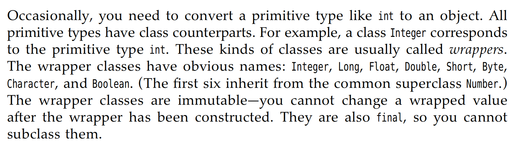

- The type parameter inside the angle brackets cannot be a primitive type
`ArrayList<int>` is not allowed.

- Because you define it must use the wrapper class, so actually it is slower obviously that `int[] array`.

## 5.5 Methods with a variable number of parameters
我们这里就很好理解了，很自然的因为所有的类型都是`Object class` 的 subclass,所以我们传入的参数事实上就是`Object[]`.
我们下面以`printf`为例子。
```java
public class PrintStream{
    public PrintStream printf(String fmt, Object... args){
        return format(fmt,args);
    }
}
```
[tips] : 这里的`...` 也是Java代码中的一部分，这个表示了这个方法可以收获许多的`objects`。

[例子]
```java
public static double max(double... values){
    double largest = Double.NEGATIVE_INFINITY;
    for(double v:values){
        if(v>largest){
            largest = v;
        }
    }
    return largest;
}
```

## 5.6 Enumeration Classes

here we introduce an example:
```java
public enum Size{
    SMALL,
    MEDIUM,
    LARGE,
    EXTRA_LARGE
}
```
you are not need to use `equals` method,because there is only $4$ instances in the enumeral class. You can simply use `==` to identify whether these 2 are the same.


```java
public enum Day {
    MONDAY("Workday"),
    TUESDAY("Workday"),
    WEDNESDAY("Workday"),
    THURSDAY("Workday"),
    FRIDAY("Workday"),
    SATURDAY("Weekend"),
    SUNDAY("Weekend");

    private String type;

    // 构造函数
    private Day(String type) {
        this.type = type;
    }

    // 获取type属性的方法
    public String getType() {
        return type;
    }
}


public class Main {
    public static void main(String[] args) {
        // 获取枚举常量和属性
        for (Day day : Day.values()) {
            System.out.println(day + " is a " + day.getType());
        }
    }
}
```

我们举了上面的例子，`MONDAY`...那些都是Day的实例instance.然后在定义的时候，顺便调用了`Day`中的`construct function` 
`public Day(String type){ this.type = type;}`
因为已经在`Day`这个类中定义了 `private String type;` `type`这个field.
那么上面的结果输出出来就是
```csharp
MONDAY is a Workday
TUESDAY is a Workday
WEDNESDAY is a Workday
THURSDAY is a Workday
FRIDAY is a Workday
SATURDAY is a Weekend
SUNDAY is a Weekend
```

## 5.7 Reflection
> 终于到Reflection了 这个Java的特性
- GPT如是说
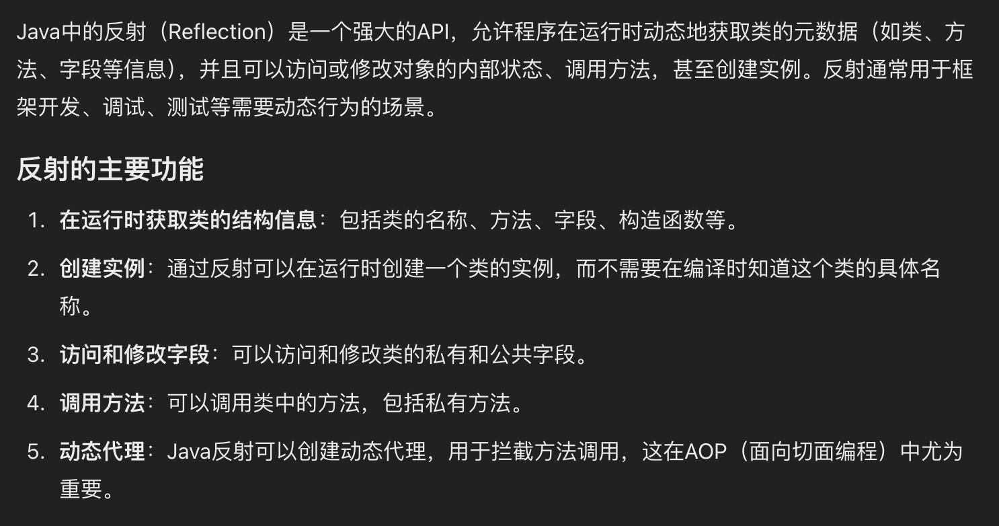
- 怎么仔细理解`reflection`？ 为什么叫做反射？
这个是一个来自物理学中的概念，反射的本质是"看到自己的样子",而Java中的反射（Reflection）机制也类似，它允许程序在运行的时候“查看”自己的结构，通过反射，程序可以在不明确知道自己包含哪些类、方法、属性的情况下，动态地检查操控自身的内部信息。


### 5.7.1 The `Class` class

> While your program is running, the Java runtime system always maintains what is called `runtime type identification` on all objects. This information keeps track of the class to which each object belongs.Runtime type information is used by the cirtual machine to **select the correct methods to execute.**

- Just like an `Employee` object describes the properties of a particular employee,a `Class` object describes the properties of a particular class.

- If the class is a package, the package name is part of the class name.

```java
var generator = new Random();
Class cl = generator.getClass();
String name = cl.getName(); // name is set to "java.util.Random"
```

- You can obtain a class object corresponding to a class name by using the static `forName` method.

```java
String className = "java.util.Random";
Class cl = Class.forName(className);// to obtain this class instance.
```

- `Class cl = Random.class`
- `Class cl = int.class` 

Another method to get the class instance.

- <span style = "color:red">if(e.getClass() == Employee.class)</span>
这个测试会抛出Exception，当e是Employee的subclass.也就是说，这个getClass()返回的类型是强类型的，不包含继承的转化，得到的是什么那么就是什么。


### 5.7.2 A primer on Declaring Exception
> When an error occurs at runtime,a program can "throw an Exception"

If you don't provide a "handle" ("catches" the exception and deals with it),the program will terminate and prints a message to the console.


### 5.7.3 Resources
> Classes often have associated data files, such as:
> - Image and sound files
> - Text files with message strings and button labels.

### 5.7.4 Using Reflection to Analyze the capabilities of classes.

- First, there are **3** classes in the $java.lang.reflect$ packages
  - $Field$
  - $Method$
  - $Constructor$
they describe the fields, methods, and constructors of a class respectively.

其实反射的这个功能很好理解，也就是获取这个class中的一些fields,methods,constructor的元信息。
- `getName`  return the name of the item
- `getType` return the type Class
- `getModifiers` return an integer with various bits turned on and off, describes the modifiers used,such as $public$ and $static$
- `getFileds`/`getMethods`/`getConsstructors` return arrays of the public fields,methods,and constructors that the class support.

### 5.7.5 Using Reflection to Analyze Objects at Runtime
> The obove Session we saw how find out the `names` and `types`.The following part, we will go one step further and actually look at the contents of the fields.

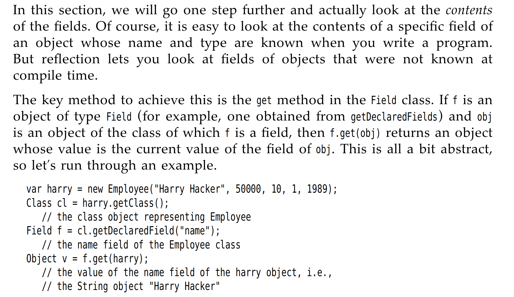
<span style = "color:red">Reflection lets you look at fields of objects that were not known at compile time.</span>

- `getDeclaredFiled`是可以访问私有字段的。

上面的代码段怎么理解呢？就是可以把他想成是Excel的形式，我们首先`Class cl = harray.getClass()` 返回了一个`Class`类的实例`Employee`。 `Fields f = cl.getDeclaredField("name")` 这个`f`也就是获得了有关`name`字段的所有内容，也就是说是像数据库中的获取了某个列的所有内容，我们的`Object v = f.get(harry)`,`Object v` 就获得的是`String`类型的`Harry Hacker`也就是这一列name字段中，属于`harry`的name。

but the code above has a problem -- The machanism of Java lets you find out what fields an object has,but it won't let you read and write the values of the fields, unless you have permission.

`field.setAccessible(true) // 绕过限制访问`

具体怎么理解 **"Reflection lets you look at fields of objects that were not known at compile time."** 这句话呢？
我们拿序列化来举例

```java
import java.lang.reflect.Field;
import java.util.HashMap;
import java.util.Map;

public class ObjectSerializer {

    public static Map<String, Object> serialize(Object obj) throws IllegalAccessException {
        Map<String, Object> result = new HashMap<>();
        Class<?> cl = obj.getClass();
        
        for (Field field : cl.getDeclaredFields()) {
            field.setAccessible(true);  // 绕过访问限制
            result.put(field.getName(), field.get(obj));
        }
        
        return result;
    }

    public static void main(String[] args) throws IllegalAccessException {
        Employee emp = new Employee("Alice", 75000, 12, 5, 1990);
        Map<String, Object> serializedData = serialize(emp);
        System.out.println(serializedData);
    }
}

```
**输出结果**
```java
{name=Alice, salary=75000, hireMonth=12, hireDay=5, hireYear=1990}
```

上面的例子其实就是很好的反应了通过Java的反射机制，我们可以动态的访问这些字段并且获取他们的值。在serialize方法用于不同类型的对象的时候，它依然可以工作，而不需要为每一种对象都定义单独的接收/判断机制。因为它们需要支持多种不同的对象结构！


### 5.7.6 Using Reflection to write generic Array Code

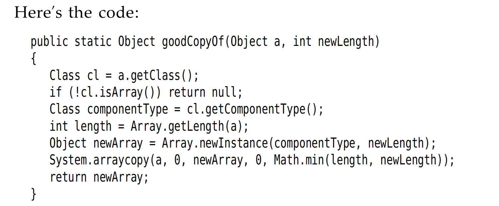

这里有一个要注意的点是 文中提及了这一个point：
> It is legal to cast an **Employee[ ]** temporarily to an **Object[ ]** array and then cast it back,but an array that started its life as an **Object[ ]** array can never be cast into an **Employee[ ]** array.
**所以我们需要利用到Reflection Package**

- First : get the class object of `a`
- Confirm that a it is indeed an array
- Use the `getComponentType` method of the Class (which is defined only for class objects that represent arrays) to find the right type for the array.

### 5.7.7 Invoking Arbitrary Methods and Constructors
> Because Java has no function pointer that, it can't like C / C++ you can execute an arbitrary function. But the following sessions we will introduce a new way to invoke the function.

其实跟上面的道理一样，我们有`getMethod` 和`getConstructor` method来获取对应的Method和Constructor的主体。
下面是几个例子
- Example for Constructor
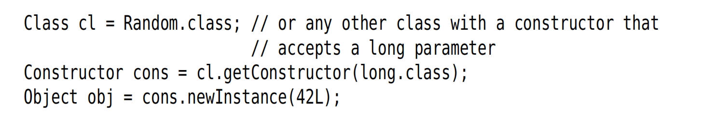
那么`cons`就类似于一个method pointer了

- Example for Method
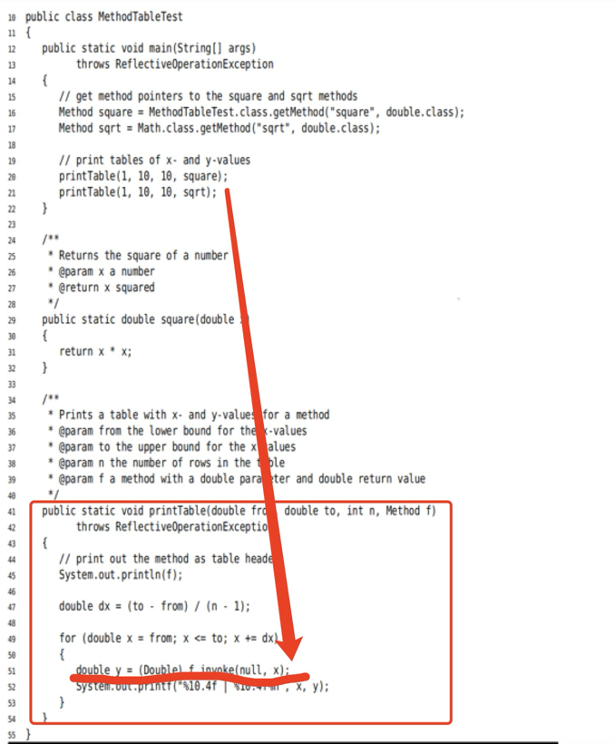
上面的`square`和`sqrt`就代表着类似method pointer.


<style>
img {
  display: block;
  margin-left: auto;
  margin-right: auto;
  width : 80%;
  border-radius: 15px; /* 将图片设置为圆形 */
  
} 
</style>