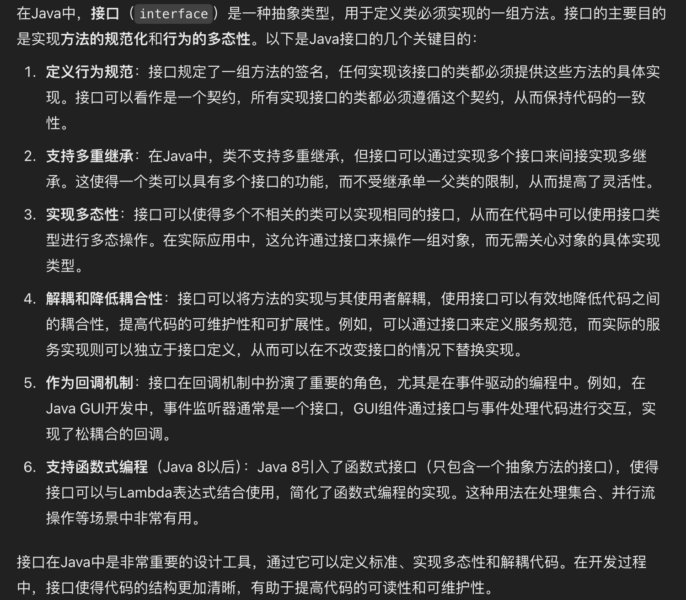
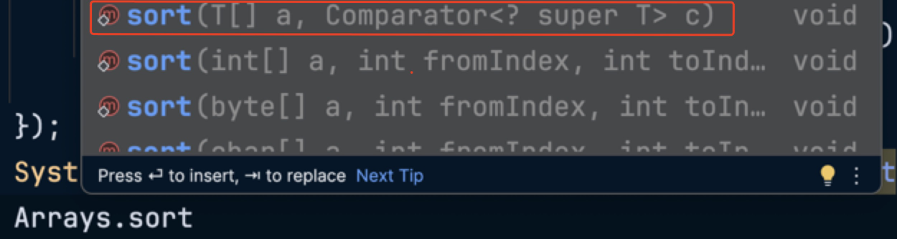
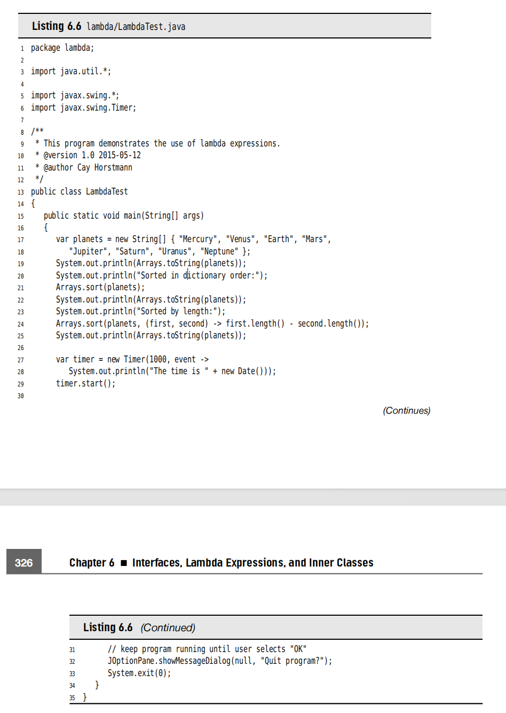
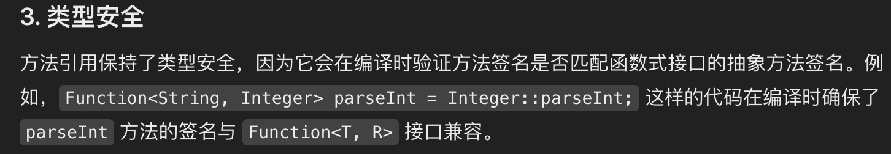

# <center>Chapter6 Interface</center>
> This chapter is about several advanced techniques that are commonly used. Despite their less obvious nature, you will need to master them to complete your Java tool chest.

The Interfaces is a way of describing what classes should do, without specifying how they should do it. 
怎么理解呢？接口就是描述了这个类需要做什么，但没有详细讲清楚他们怎么做。


## 6.1 Interface

> Typically, the supplier of some service states: "If your class conforms to a particular interface, then I'll perform the service." 也就是说，如果某个类符合提供的接口标准，那么就可以使用这个接口。

```java
// An example of interface;
public interface Comparable{
    int compareTo(Object other);
}
```

- This means that every class which want to implements the interface must **have this method** `compareTo`, and the method must take an `Object` parameter and return an integer.
- All methods of an interface must be `public`, so you have not need to add the public into the method.
- An interface can have multiple methods.
- Interfaces never have instance fields.


### 6.1.1 Implement the interface
- Step1: declare that your class intends to implement the given interface.
`class Employee implements Comparable`

- Step2 : supply definitions for **all methods** in the interface


```java
public interface Comparable{
    int compareTo(Object other);
}

class Employee implements Comparable<Employee>{
    public int compareTo(Object otherObject){
        Employee other = (Employee) otherObject;
        return Double.compare(salary,other.salary);
    }
}
```

> You see that why can't the Employee class simply provide a `compareTo` method without implementing the `Comparable` interface?

<span style = "color:red">The reason is that the Java Programming language is strongly typed(强类型)</span>,when making a method calling, the compiler needs to be able to check that the method actually exists. 也就是说其实Java因为是强类型的，

**- GPT 如是说：为什么要使用接口**


### 6.1.2 The properties of Interfaces
> Interfaces are not classes. In particular, you can never use `new` operator to instantiate an interface.

```java
Comparable x; // OK
x = new Employee(...);// OK provided Employee implements Comparable.
```


- Just as the same as you can build hierarchies of classes, you can `extend` interfaces. 
这里 `extends`这个关键词就出现了，像Java类那样可以有继承，对于接口来说也可以有拓展，也就是`extends`.

```java
public interface powered extends Moveable{
    double milesPerGallon();
}

public interface powered extends Moveable{
    double milesPerGallon();
    double SPEED_LIMIT = 95;
    // a public static final constant;
}
```

- each class can implemet many interfaces.
  the designer of Java chose not to support multiple inheritance, because it makes the language either `complex` and `less efficient`.

### 6.1.4 Static and Private Methods
> As of Java 8, you are allowed to add static methods to interfaces.

> As of Java 9, methods in an interface can be `private`. A private method can be static or an instance method. **Since private methods can only be used in the methods of the interface itself, their use is limited** to being helper methods for the other methods of the interface.

### 6.1.5 Default Methods
> It is a modifier. Actually, it is not very useful because of the reason that you may override it many times. But in the iterator, `remove()` method is very useful.

其实也就是说，对于接口，很好理解，有些方法是可以不用重写的，那么某个类如果符合这个接口的要求就可以直接使用，而且有了 `default`关键字，那些不依赖类实现本身细节的方法就不用重写，直接调用即可。

```java
public interface Iterator<E>{
    // E is the type of the element;
    boolean hasNext();
    E next();
    default void remove(){
        throw new UnsupportedOperationException("remove");
    }
}
```

还有一个现实的问题，就是很常见的`interface evolution`，比如我们考虑一个`Collection`接口，用了很多年了，然后我们有个类调用了这个接口。但是随着版本的更新，我们在`Collection`这个接口中添加了一个方法，但是如果不添加`Default`关键字的话，就会导致一个问题，无法编译并且会抛出错误。那么对于大项目的话就直接gg。所以添加`Default`关键字可以规避这个问题。可以安心的给接口添加新的methods或者methods更改了。


### 6.1.6 Resolving the Default Method conflicts
当一个方法定义以`default`在一个接口中,然后又同样的定义在一个超集中(superclass)，那么Java是如何解决这样的冲突呢？

- 父类赢。If a **superclass** provides a concrete method, default methods with the same name and parameter types **are simply ignored.**
- Interface Clash.(同一个方法出现在了两个接口中)那么就需要`override`来重写这个方法了。可以避免出现conflict的情况。

### 6.1.7 Interfaces and callbacks
`callback`, represents that you specify the action that should occure whenever a particular event happens. 也就是有个反馈机制。

下面举个例子，就是关于 `ActionListener` 
```java
// here offer an interface;
public interface ActionListener{
    void actionPerformed(ActionEvent event);
}

// We call the interface;
class TimePrinter implements ActionListener{
    // override the interface;
    /**
     * @param event the description of the event;
     */
    public void actionPerformed(ActionEvent event){
        // 
        System.out.println("At the tone,the time is "+Instant.ofEpochMilli(event.getWhen()));
        Toolkit.getDefaultToolkit().beep();
    }
}
```

### 6.1.8 The Comparator Interface 



上面就是一个Java的sort众多重载`overloading`方法中的一个,**可以传入比较器**

```java
var comp = new lengthComaprator();
if(comp.compare(words[i],words[j])>0)...

// method2 
String[] friends = {"1","2"};
// 这里就是对应上面的 sort(T[] a,Comparator<? super T>c)
Array.sort(friends,new lengthComparator());
```

### 6.1.9 Object Cloning
> here introduce an interface that about the object cloning;

我们这里要区分一下 `shallow clone` 和 `deep clone` ：
- `shallow clone`:是运用到 immutable 不可变的话，那么是可以利用浅克隆的.只复制对象的第一层数据，对于引用类型的字段，它只复制引用地址，而不会复制引用对象本身。
也就是说，如果原始对象的引用类型字段指向了一个对象，那么浅拷贝后的该字段将指向同一个对象，因此，修改拷贝对象中的引用类型的字段，原来的也会进行改变。
- `deep clone` : 是运用深拷贝，一个词来形容 **完全独立**，因为我们是递归的拷贝其包含的全部引用对象，并且创造出全新的实例。不会出现上面的情况。
```java
// shallow clone
class ShallowCloneExample implements Cloneable {
    int value;
    int[] array;

    public ShallowCloneExample(int value, int[] array) {
        this.value = value;
        this.array = array;
    }

    @Override
    protected Object clone() throws CloneNotSupportedException {
        return super.clone(); // 仅复制第一层
    }
}

// 使用浅拷贝
ShallowCloneExample original = new ShallowCloneExample(10, new int[]{1, 2, 3});
ShallowCloneExample clone = (ShallowCloneExample) original.clone();


// deep clone
class DeepCloneExample implements Cloneable {
    int value;
    int[] array;

    public DeepCloneExample(int value, int[] array) {
        this.value = value;
        this.array = array.clone(); // 递归拷贝引用类型
    }

    @Override
    protected Object clone() throws CloneNotSupportedException {
        DeepCloneExample deepClone = (DeepCloneExample) super.clone();
        deepClone.array = array.clone(); // 手动克隆每个引用类型
        return deepClone;
    }
}

// 使用深拷贝
DeepCloneExample original = new DeepCloneExample(10, new int[]{1, 2, 3});
DeepCloneExample clone = (DeepCloneExample) original.clone();

```
虽然`deep clone`可以完全独立原始的对象，但效率比较低，因为当一个类中所包含的字段太多的时候，那么递归的拷贝就会导致效率低下。


## 6.2 Lambda expressions
Why use the Lambda expressions?
- A lambda expression is a block of code that you **can pass around so it can be executed later, once or multiple times**.
一个代码段，你可以立刻执行，并且执行很多次

可能你会想，那你调用函数多次不也是一样的吗？还真不一样，因为Java是OOP语言，也就是说所有的`method`都是基于`class/instance`的，那么如果你调用一个函数多次，也就是说你需要重复创建实例，最好想到的例子就是`sort`中的`comparator`.而`lambda expressions`就很容易的解决了这个问题。
<span style = "color:red">考虑事情的本质：其实就是跟语言的特性息息相关的，Java是最典型的OOP语言，那么你的所有方法都是基于class/instance的，你调用方法就要考虑创建对象的开销</span>

### 6.2.2 The syntax of Lambda Expressions

- we want to compute `first.length() - second.length()`
- 然后我们考虑,`first`和`second`都是`String`类型的，因此我们可以写成这样
`(String first,String second)
->first.length()-second.length()`

比较本质的表达就是 
**parameters , the `->` arrow, and an expression**
- Another case is that our expression is a code block 
```java
// lambda expression;
(String first,String second)->{
    if(first.length()<second.length())
        return -1;
    else if(first.length()>second.length())
        return 1;
    return 0;
}
```

- if the lambda expression has no parameters that you still supply empty parentheses.
```java
()->{
    for (int i=0;i<100;i++)
        System.out.println(i);
}
```




### 6.2.3 Functional Interfaces
> you'd better think of a lambda expression as a function, not an object, and to accept that it can be passed to a functional interface.

`@FunctionalInterface`  这个注释的目的就是显式声明一个接口是函数式接口。如果一个接口使用了这个注释，编译器会确保它只包含到一个`method`.

- You can supply a lambda expression whenever **an object of an interface with a single abstract method** is expected.

```java
var timer = new Timer(1000,event->{
    System.out.println("At the tone"+Instance.ofEpochMilli(event.getWhen()));
});
```

Actually,conversion to a **functional interface**is the only thing that you can do with a lambda expression in Java.

### 6.2.4 Method References

- Example 1 :
  Sometimes, you may call `var timer = new Tiemr(1000,event -> System.out.println(event))`
- Example 2:
  这个时候，方法的引用就出来了
  `var timer = new Timer(1000,System.out::println)`
  This is called **Method Reference**,It directs the compiler to produce an instance of a functional interface,overriding the single abstract method of the interface to call the given method.

- 可能有时候，一个函数签名有多个`overloading`的情况，那么使用`method reference`就可以让编译器去帮你寻找可以使用的，例如 `Max`就有两种`for integer`和`for double`

### 6.2.5 Constructor References
> 像 Method Reference 一样，其实就是构造函数的引用。

我们使用`Person[] people = stream.toArray(Person[]::new)`
因为`Person::new`就是constructor reference.

### 6.2.6 Variable Scope
> 在Lambda匿名函数中，经常会出现一种情况，就是你会运用到这个method域中的传入的parameters.

下面是两个例子
```java

// legal
public static void reapeatMessage(String text,int delay){
    ActionListener listener = event ->{
        System.out.println(text);
        Toolkit.getDefaultToolkit().beep();
    };
    new Timer(delay,listener).start();
}

// illegal
public static void countDown(int start,int delay){
    ActionListener listener = event ->{
        start -- ; // error;
        System.out.println(start);
    };
    new Timer(delay,listener).start();
}
```

我们看下面这个例子就是非法的，虽然Java可以捕捉到方法中传入的参数，但必须是不可变的。就像这个传入的`start`，是不可变的。

The rule is that any captured variable in a lambda expression must be `effectively final`.


## 6.3 Inner class
> An inner class is a class that is defined inside another class.

- Inner class can be hidden from other class in the same package.
- Inner class methods can access the data from the scope in which they are defined - include the data that would otherwise be private.

## 6.4 Service Loaders
> JDK offers a simple machanism for loading services.


<style>
img{
    display : block;
    margin-left : auto;
    margin-right : auto;
    width : 80%;
    border-radius:15px;
}
</style>

