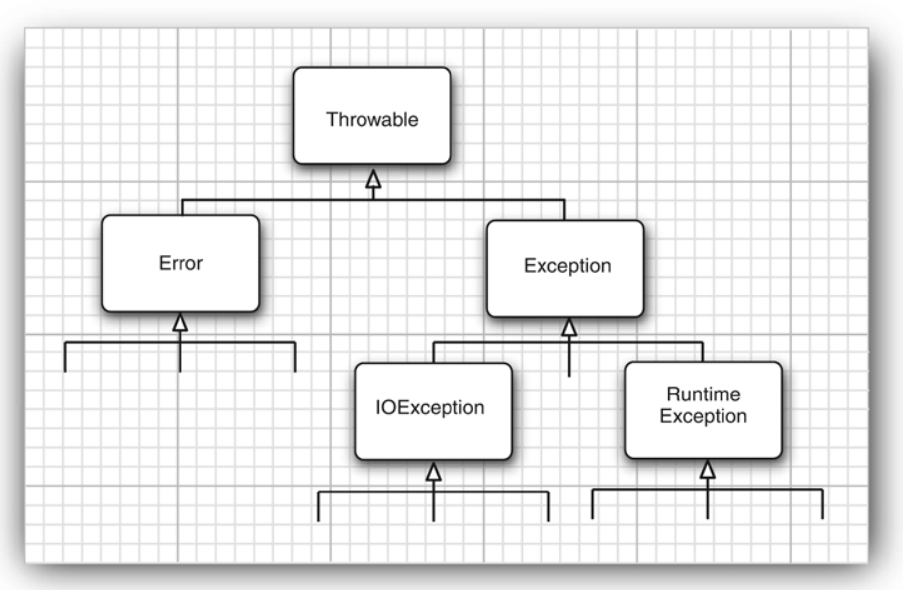
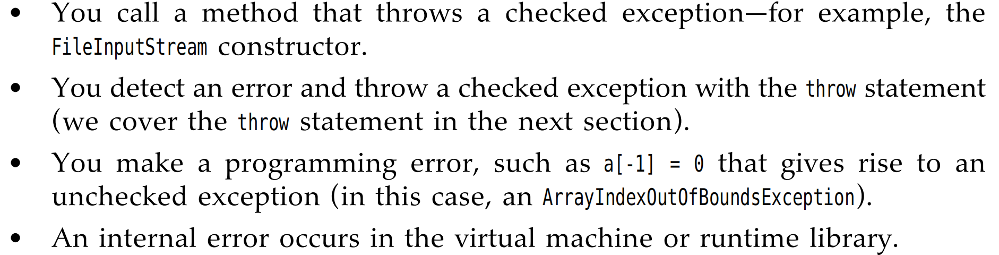

# <center>Chapter7 Exception</center>
> It is time to turn to the mechanisms the Java programming language has for dealing with the real world of bad data and buggy code.

- Notify the user of an error
- Save all work
- Allow user to gracefully exit the program

Java uses a form of error handling `exception handling`.

When an error occurs that, you might want to 2 cases:
- Return to a safe state and enable the user to execute other commands;
- Allow the user to save all the works and terminate the program gracefully.


当然，以上的两种情况并不容易，因为侦查发生错误的代码和实际上发生错误的代码相去甚远，那么`exception handling`的使命就是将错误发生的控制权转移到能够处理错误的程序上。所以你应该提前的预计错误的发生。

很多时候，我们总是寄希望于让错误得到`return`,比如在浏览文件的末尾的时候，会返回`-1`。但事实上很多时候，并没有错误会返回。我们也无从而知。在Chapter5中的时候，我们知道了Java为每一个`method`提供了一个可代替的出口，当它无法正常的完成它的任务的时候。在这种情况下，它并不会返回一个`expectation value`，而是会`throws`一个对象->将错误的信息封装的`object`. 当`throws`了一个错误的对象的时候，不会重新开始程序，但这时候`expection handling`会寻找可以解决这个`object`的`exception handler`.

## Throwable Class
事实上，我们抛出的`exception`对象是一个来自于`Throwable`类的实例


上面的类分成了两部分，我们重点考虑的是`Exception`，首先，这里的`Error`其实大概率是不用考虑的，它更多是来自内在的错误，亦或者说是来自`Java runtime System`中的错误。而`Exception`中的`RuntimeException`才是我们真正平时编码时候发生的错误。
对于`RuntimeException`发生的一些常见的错误：

- A bad cast 类型转化错误
- An out-of-bounds array access 数组边界越界
- A null pointer acess 获取了一个`null`对象
而 `FileCoundNOTFind`这种错误并不是发生在你代码上的逻辑/语法错误，而是在尝试打开文件的时候就已经发生错误了。


### checked or unchecked
我们这里考虑`checked`的含义，它表示的是在程序编译运行前就需要进行的检查，官方的定义是：
> The Java Language Specification calls any exception that derives from the class `Error` or the class `RuntimeException` an `unchecked` exception.All other exceptions are called `checked` exceptions.

很明显，你在运行Java代码之前，你并不知道你会遇到什么错误，这个是无法被`checked`.但有些错误，类似于IO/文件读入...等错误是需要在编译前就发现的，并不是代码本身的逻辑发生的错误，这些错误是要`checked`.

### Declaring Checked Exception
The idea is that : a method will not only tell the Java compiler what values it can return, **It is also going to tell the compiler what can go wrong.** 提前告诉Java可能出错的地方。

```Java
public FileInputStream(String name) throws FileNotFoundException;
```
上面这个例子就是提示了编译器，我们会对文件进行操作，可能会发生所需要读取的文件不存在的错误。-> Tell the compiler what can go wrong.


以上就是可能出现的四种情况，我们需要牢记;

**If the superclass throws no Exceptions,the subclass must not throw the Exception!**

## Catch the Exception
- If any Exception happened in the `try` block
  - skip the remainder code in the `try` block and do the `catch` clause
- If no exception ->skip

You can catch more than one Exception in the `catch` clause.
```js
try{
    //access the database
}catch(SQLException original){
    throw new ServletException("database error: "+e.getMessage());
}catch(FileCoundNotFoundException e){
    System.out.print(e);
}
```

上面显示了可以`catch`多个`Exceptions`;
也可以`rethrow`;


### The finally Clause
首先，我们知道当遇到`Exception`的时候，我们会停止这个`method`中的进程，然后退出这个方法。但这里有个问题，如果你在`method`中进行了资源的获取，但你退出这个代码的时候，需要把这些资源给释放掉，但是只有你在原来的方法中才知道这些。这样`finally`子句的目的就是为了解决这个问题。

```java
var in = new FileInputStream(...);
try{
    //1
}catch(Exception e){//2
 //3

}finally{//4
    // remember to close the FileInputStream;
    in.close(); //5
}
```

像上述的，倘若没有遇到问题，在完成`try clause`中的内容的时候，会自动跳过`2,3`的部分，直接完成`finally`部分的内容。也就是结束资源。 
> Whether it encounters the `Exception` -> we all need to execute the `finally` clause.

## try-with-resource satement
> 这个语句是用于自动管理资源（文件/数据库连接等）的结构

使用 `try-with-resource`语句，可以确保在语句结束的时候自动关闭资源，避免资源泄漏。

```java
import java.io.BufferedReader;
import java.io.FileReader;
import java.io.IOException;

public class TryWithResourcesExample {
    public static void main(String[] args) {
        try (BufferedReader reader = new BufferedReader(new FileReader("example.txt"))) {
            String line;
            while ((line = reader.readLine()) != null) {
                System.out.println(line);
            }
        } catch (IOException e) {
            e.printStackTrace();
        }
    }
}


// pattern
try(ResourceType resource = new ResourceType()){
    // 使用资源的代码
}catch(Exception e){
    // 异常处理；
}

```
以一言鉴之，也就是在使用`try`语句的时候我们调用了获取资源的语句，尤其是一些进行需要显性关闭资源的语句，可以进行自动的资源管理。无论会不会完成后续的`catch`,都会直接的完成`close()`


<style>
    img{
        margin-left : auto;
        margin-right: auto;
        display:block;
        width:80%;
        border-radius:15px;
    }
</style>