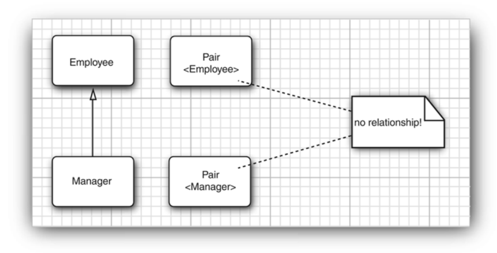

# <center>Chapter8 Generic Programming</center>

> Why Generic Programming?
>
> It means writing code that can be **reused** for objects of many different types; 
> 
> 泛型编程 目的是让代码可以具有高复用性

## 8.1 Introduce
#### 例子
```java
public class ArrayList{
    private Object[] elementData;
    ...
    public Object get(int i);
    public void add(Objct o);
}

// If we want to use the ArrayList;
ArrayList files = new ArrayList();
String filename = (String)files.get(0);
files.add(new File("..."));


// But with Generic Programming
var files = new ArrayList<String>();

// Another way to write;
ArrayList<String> files = new ArrayList<>();
```
View the above Code block, that you will see the advantages of Generic Programming:

1. You can make your code read easier;
2. You can tell right away that this particular array List contains `String` objects;

## 8.2 definite a simple generic class

Here is the example code:
```java
public class Pair<T>
{
 private T first;
 private T second;

 public Pair() { first = null; second = null; }
 public Pair(T first, T second) { this.first = first; this.second = second; }

 public T getFirst() { return first; }
 public T getSecond() { return second; }
 
 public void setFirst(T newValue) { first = newValue; }
 public void setSecond(T newValue) { second = newValue; }
}
```
The `Pair` class introduces a type variable `T`, enclosed in angle bracket`<>`,after the class name. It also allows you to put more than one type name in the bracket.
Like : 
`public class Pair<T,U>{...}`


## 8.3 Generic Methods

> You can define generic methods both inside ordinary classes and inside generic classes.

```java
class ArrayAlg{
    public static <T> getMiddle(T .. a){
        return a[a.length/2];
    }
}

// Option 1
String middle = ArrayAlg.<String>getMiddle("John","Q.","Public");

// Option 2
String middle = ArrayAlg.getMiddle("John","Q.","Public");

```

The above code block is the example


## 8.4 Bounds for type variables
When you achieve the generic methods with like `comparable` part, you must give a `bound` for the type variable `T`.

```java
class ArrayAlg
{
    public static <T> T min(T[] a) // almost correct
    {
        if (a == null || a.length == 0) 
            return null;
        T smallest = a[0];
        for (int i = 1; i < a.length; i++)
            if (smallest.compareTo(a[i]) > 0) 
                smallest = a[i];
        return smallest;
    }
}

// The above part has a bug that you must define the method like the following
    public static <T extends Comparable> T min(T[] a);
// We use an interface to let the type T's params can have the ability to comparable;

```

## 8.5 Generic Code and the virtual machine
### 8.5.1 Type Erasure
If the type `T` has no bounds that it raw type can be the `Object`.
```java
public class Pair
{
    private Object first;
    private Object second;
    public Pair(Object first, Object second)
    {
        this.first = first;
        this.second = second;
    }
    public Object getFirst() { return first; }
    public Object getSecond() { return second; }
    public void setFirst(Object newValue) { first = newValue; }
    public void setSecond(Object newValue) { second = newValue; }
}

// If we extends the interfaces, the raw type will be interfaces
public class Interval<T extends Comparable & Serializable> implements Serializable
{
    private T lower;
    private T upper;
    . . .
    public Interval(T first, T second)
    {
        if (first.compareTo(second) <= 0){ 
        lower = first; 
        upper = second; 
        }else { 
        lower = second; 
        upper = first; 
        }
    }
}

public class Interval implements Serializable
{
 private Comparable lower;
 private Comparable upper;
 . . .
 public Interval(Comparable first, Comparable second) { . . . }
}

```
泛型方法在编译前后，只会留下一个方法，类型用`Object`或者 `Comparable` 边界类型替换，但是这样就会导致一些影响:

1. 类型擦除后，范型信息会在字节码种丢失 **(因为虚拟机中没有泛型这个概念)**
2. 所有泛型相关的操作只能依赖运行时候的类型信息
#### 泛型类型擦除与方法冲突 (with Bridge Methods)
> 什么是泛型类型擦除时候的方法冲突？
> 
`public void setSecond(LocalData second)` 
在类`DataInterval`中只有一个方法，这个方法是从`Pair<LocalData>` 中继承的，但我们有额外的声明，那就是
**这个方法的作用是为对象设置第二个日期值，同时确保第二个不小于第一个值**，但是在类型的擦除的时候，方法会发生泛型冲突。

> `public void setSecone(Object second)`.因此，在类型擦除后，`DateInterval` 类会有两个 `setSecond` 方法：
> 
> - 一个是子类中定义的：`public void setSecond(LocalDate second)`
> - 一个是从父类中继承的：`public void setSecond(Object second)`

这里介绍一下 `Bridge Methods` 桥接方法
为了解决上述因为泛型擦出过后产生的多态问题，编译器会生成一个`桥接方法`
```java
public void setSecond(Object second) {
    setSecond((LocalDate) second);
}

Pair<LocalDate> pair = new DateInterval();
pair.setSecond(aDate);

```
- 由于 `pair` 是 `Pair<LocalDate>` 类型，因此调用的是 `setSecond(Object)` 方法。
- 但实际运行时，`pair` 引用的是 `DateInterval` 对象。
- 虚拟机会调用 `DateInterval.setSecond(Object)`，即桥接方法。
- 桥接方法内部会将 `Object `参数强制转换为 `LocalDate`，并调用真正的 `DateInterval.setSecond(LocalDate)` 方法。

Summary : 

1. 泛型在虚拟机中不存在，泛型只是编译器的一个语法糖
2. 类型参数会被边界参数替代
3. 桥接方法来解决冲突的问题

### Syntactic Sugar 语法糖
> Here is the wiki reference:
> In computer science, syntactic sugar is syntax within a programming language that is designed to make things easier to read or to express. It makes the language "sweeter" for human use: things can be expressed more clearly, more concisely, or in an alternative style that some may prefer. Syntactic sugar is usually a shorthand for a common operation that could also be expressed in an alternate, more verbose, form: The programmer has a choice of whether to use the shorter form or the longer form, but will usually use the shorter form since it is shorter and easier to type and read.

> For example, many programming languages provide special syntax for referencing and updating array elements. Abstractly, an array reference is a procedure of two arguments: an array and a subscript vector, which could be expressed as `get_array(Array, vector(i,j))`. Instead, many languages provide syntax such as `Array[i,j]`. Similarly an array element update is a procedure consisting of three arguments, for example `set_array(Array, vector(i,j), value)`, but many languages also provide syntax such as `Array[i,j] = value`.

> A construct in a language is syntactic sugar if it can be removed from the language without any effect on what the language can do: functionality and expressive power will remain the same.

> Language processors, including compilers and static analyzers, often expand sugared constructs into their more verbose equivalents before processing, a process sometimes called "desugaring".

简而言之，就是语法糖是编译语言新增的特性，指的是一些对开发者更加友好、更易于书写或理解的语法，不会增加语言本身的功能，这些语法特性在编译或运行的时候统统会呗转化为更加底层的、更基础的语言结构。
以一言蔽之，**语法糖，就是让代码更加优雅，更简便的封装**。

上面泛型的例子其实就是，在Java的虚拟机中不存在泛型，只存在普通的类和方法，因此这个泛型就变成了对于开发者更友好的一种Java的特性，仅此而已。

## 8.6 Restrictions and Limitations
1. Type parameters cannot be instantiated with `primitive types`, only can be used `wrapper types`.
   
    1. `Pair<Double>` 不能被写成`Pair<double>`  

2. Runtime type inquiry only works with raw type
3. You cannot Create Arrays of Parameterized Types
    
    What you can do, is to used the `ArrayList` to replace the `Array`.

4. Varargs Warnings
5. Type Variables are not Valid in StaticContexts of Generic Classes
 
... 还有很多限制 就不一一罗列了

## 8.7 Inheritance Rules for Generic Types

In general, there is no relationship between `Pair<S>` and `Pair<T>`, no matter how `S` and `T` are related.

The following is an illegal code:
```java
Manager[] topHonchos = ... ;
Pair<Employee> result = ArrayAlg.minmax(topHonchos); // error
```

The `minmax` returns a `Pair<Manager>`, not a `Pair<Employee>`


## 8.8 Wildcard Types 通配符类型
在 Java 中，通配符类型`（Wildcard Types）` 是泛型的一部分，用于提高泛型的灵活性。通配符的作用是对泛型的类型参数进行一定程度的“模糊匹配”，以适应更多的场景。以下是对通配符类型的详细介绍： 

### 通配符的分类
#### 无界通配符 `?`
表示的是任意类型，没有限制，尤其是你只关系其数据，而不是类型的时候,只需要读取数据，而不是往集合中写入数据。
```java
public void printList(List<?> list){
    for(Object obj : list){
        System.out.println(obj);
    }
}
```

#### 有界通配符 
##### 上界通配符 `? extends T`
表示的是通配符是某个类型`T`的子类（包括`T`本身）

```java
public void processNUmbers(List<? extends Number> list){
    for(Number number : list){
        System.out.println(number.doubleValue());
    }
}
```

- `List<? extends Number> `表示可以接受 `List` 的泛型类型为 `Number` 或 `Number` 的子类，例如 `List<Integer>` 或 `List<Double>`。
- 读取： 可以安全地读取数据，类型保证是 `Number` 或其子类。
- 写入： 不能安全地写入，除了 `null`。

##### 下界通配符  <? super T>
表示的是某个类型`T`的父类，(包括`T`本身)
和上述同理，不再赘述。

在上面介绍了几种通配符，很自然的就知道了，我们可以在上界通配符用于只读的操作，而对于下界通配符的时候，进行只写的操作（下界通配符保证了写入的类型一定是本身或者父类的情况）。


## 8.9 Reflection and Generics
> Reflection lets you anaylyze arbitrary objects at runtime, but if the objects are instances of generic classes, you don't get much information about the generic type parameters because they have been erased.

### 反射如何获得泛型的信息
#### 1. 获取类的泛型信息
可以通过反射中的 `Type` 和 `ParameterizedType`接口来获取泛型的具体类型
#### 2. 可以获取字段的泛型类型
#### 3. 可以获取方法的泛型信息
可以通过反射获取方法的返回值、参数或声明的泛型类型


<style>
img{
    display : block;
    margin-left : auto;
    margin-right : auto;
    width : 80%;
    border-radius:15px;
}
</style>

