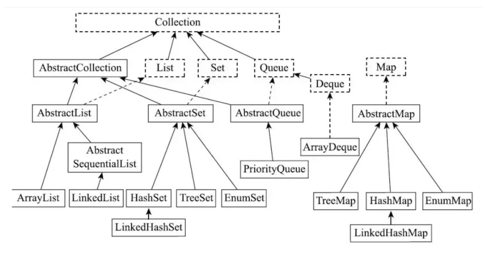

# 
Chapter9 Collections

> 集合类 ：感觉有点像 `Cpp` 中的 `stl` 下面是官方的定义 ：
>
> The java library can help you accomplish the traditional data structuring needed for serious programming. 其实就是一个库方便我们来调用传统的数据结构。
>

## Introduce 

我们这里区分两个概念 `Collection` 和 `Collections`

- `Collection` : 表示的是Java集合框架的一个接口，它是所有集合类的基础接口。它定义了一组通用的操作和方法，如添加、删除、遍历等，用于管理一组对象。`Collection` 接口有许多`Implementations` 如 `List`,`Set`和`Queue`.
- `Collections` : 表示的是Java提供的一个工具类，位于`java.util`包中。它提供了一系列的静态方法，用于对集合进行操作和算法。`Collections`中包含的包括`Sorting`,`Search`,`Reverse`...等算法，这些方法等实现了`Collection`接口集合的算法。

接着，我们区分两个概念 `数组` 和 `集合`。二者的区别：

- 数组是**固定的长度**的数据结构，一旦创建长度就无法改变，而集合是**动态长度**的数据结构，可以动态的调整长度。 
- 数组可以包含 `primitive type` 和 `Object`，集合中只能包含`Object`。
- 数组可以直接访问元素，集合需要通过迭代器或者其他方法访问元素。

## 9.1 The Java Collections Framework
### 9.1.1 Collection Interfaces and Implementation
> 区分接口和实现类

- `接口` : 定义了集合的行为和操作
- `实现类` : 提供了接口的具体实现，决定了集合的存储方式和性能

我们看上图，在`Collection`下面的那一层 `List` 、`Set` 、`Queue` 、`Map`就是为接口而下面的内容就是基于以上接口的具体实现类。

#### Collection
首先是 `Collection` 接口，它是集合框架的顶层接口，它定义了基本的集合操作

1. `add(E e)`
2. `remove(Object o)`
3. `iterator()` 

#### List 
`List` 是有序的Collection，使用此接口可以精准的控制每个元素的插入位置，用户能根据索引访问`List`中的元素，属于`List`的基本操作

- `get(int index)` 获得 `this.index = index` 位置上的元素
- `add(int index, E element)` 在指定位置插入元素
- `set(int index, E element)` 替换指定索引的元素

常见的 `List` 的实现类有：
1. `ArrayList`
2. `LinkedList`
3. `Vector` (过时，但是线程安全)

#### Set 
`Set` 表示的是一个无序的集合，但是不允许重复元素

常见的`Set`的实现类有：

1. `HashSet` 基于哈希表实现
2. `LinkedHashSet` 基于哈希表，维护插入顺序
3. `TreeSet` 基于红黑树，**而且元素有序**

#### Map
`Map` 是一个独立的接口，并不继承`Collection`接口。`Map`表示键值对(KV)模型的映射，允许我们存储和操作基于键的元素集合 **（键不能重复，但是值可以重复）**

常见的操作 ： 

1. 增加键值对 `put(K key,V value)`
2. 根据键查值 `get(Object key)`
3. 删除键值对 `remove(Object key)`

常见的`Map`的实现类

1. `HashMap`
2. `LinkedHashMap`
3. `TreeMap` 

#### Queue 
队列是基于`Collection`接口的继承接口,常见的操作有 :
> 表示一个队列，遵循`FIFO`先进先出的原则

方法 ： 

- `add(E e)/offer(E e)` 向队列尾部添加元素
- `poll()` 从队头获取并移除元素
- `peek()` 从队头获取但不移除

这里的 `poll()` 和 `peek()` 其实有点类似 `top()` 和 `pop()` 区别是否移除顶部元素

常见的实现类 ： 
- `PriorityQueue` 
- `LinkedList` 同时实现了 `List` 和 `Queue`

